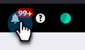

# Automatische Bereinigung von Auslöser-Kampagnen {#automatic-trigger-campaign-cleanup}

Marketo bietet einen netten/kostenlosen Service zum Deaktivieren von ausgelösten Smart-Kampagnen, die keine Aktivität mehr erhalten. Dies beschleunigt die Gesamtleistung des Systems und spart Ihnen Zeit.

## Was passiert? {#what-happens}

Einmal im Quartal wird Marketo Smart-Kampagnen finden, die seit 6 Monaten oder länger nicht aktiv sind, und diese deaktivieren.

## Wirst du mich zuerst benachrichtigen? {#will-you-notify-me-first}

Natürlich! Einmal im Quartal erhalten Sie eine Woche im Voraus eine Benachrichtigung, die jede Kampagne zeigt, die wir deaktivieren möchten.

1. Klicken Sie auf **[!UICONTROL Benachrichtigungen]**-Symbol.

   

1. Klicken Sie **[!UICONTROL Idle Trigger Campaign Cleanup Scheduled]**. Klicken Sie dann auf **[!UICONTROL Link Diese Idle-Trigger-Kampagnen werden deaktiviert]**.

   

   Es wird eine Liste mit Smart-Kampagnen angezeigt, deren Deaktivierung geplant ist.

   

## Welche Kampagnen werden deaktiviert? {#which-campaigns-will-be-deactivated}

Wir werden nur Trigger-Kampagnen deaktivieren, die seit über 6 Monaten aktiv sind, aber in diesem Zeitraum 0 Personen qualifiziert haben.

## Einen Augenblick! Nicht diese Kampagne! {#wait-not-this-campaign}

Keine Sorge - die Uhr einer Smart-Kampagne kann wie folgt zurückgesetzt werden:

* Eine Person, die sich für die Kampagne qualifiziert.
* Manuelles Deaktivieren und Reaktivieren der Kampagne.

Beide setzen den 6-Monats-Zähler zurück.

## Können Sie mir mitteilen, welche Kampagnen deaktiviert wurden? {#will-you-let-me-know-which-campaigns-were-deactivated}

Absolut - eine Woche nach der ursprünglichen Benachrichtigung werden wir die aufgelisteten Kampagnen deaktivieren (abzüglich aller Kampagnen, die sich für mindestens eine Person qualifiziert haben oder deaktiviert/reaktiviert wurden) und eine Bestätigungsbenachrichtigung posten.

1. Wählen Sie die Benachrichtigung **[!UICONTROL Idle Trigger Campaign Cleanup Scheduled]** aus. Klicken Sie auf **[!UICONTROL Link Diese Trigger-Idle]** Kampagnen .

   

1. Es wird eine Liste der deaktivierten Kampagnen angezeigt.

   
