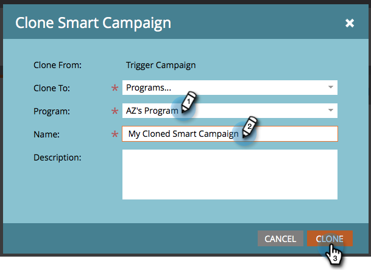

# Kampagnenaktionen: Klonen einer intelligenten Kampagne {#campaign-actions-clone-a-smart-campaign}

Durch das Klonen von Kampagnen sparen Sie Zeit. Sie müssen nicht alles von Grund auf neu erstellen - durch das Klonen wird eine identische Kampagne mit genau denselben Smart List-Filtern und Flussschritten erstellt.

1. Wählen Sie die Kampagne aus, die Sie klonen möchten. Wählen Sie in **[!UICONTROL Dropdown]** Liste Kampagnenaktionen die Option **[!UICONTROL Klonen]** aus.

   

1. Wählen Sie die entsprechende Option **[!UICONTROL Klonen in]**. Wählen wir in diesem Beispiel &quot;**[!UICONTROL &quot;]**.

   

1. Wählen Sie ein **[!UICONTROL Programm]**. Geben Sie einen **[!UICONTROL Kampagnennamen]** ein und klicken Sie auf **[!UICONTROL Klonen]**.

   

Und fertig!
