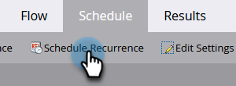

# Abbrechen eines geplanten wiederkehrenden Batch-Kampagnenausführens {#cancel-a-scheduled-recurring-batch-campaign-run}

Wenn Sie eine wiederkehrende Batch-Kampagne haben, die Sie nicht mehr benötigen, können Sie die zukünftigen Ausführungen abbrechen. So geht es.

1. Wählen Sie die Smart-Kampagne aus und klicken Sie auf die Schaltfläche **Zeitplan** Registerkarte.

   

1. Klicks **Intervall planen**.

   

   >[!TIP]
   >
   >Sie können einen einzelnen Lauf abbrechen, indem Sie auf die  daneben. Erfahren Sie, wie [Abbrechen einer geplanten Batch-Kampagnenausführung](/help/marketo/product-docs/core-marketo-concepts/smart-campaigns/using-smart-campaigns/cancel-a-scheduled-batch-campaign-run.md){target="_blank"}.

1. Zeitplan auf **[!UICONTROL Keines]** und klicken **[!UICONTROL Speichern]**.

   

   Voila! Ihre Smart-Kampagne wird nicht mehr ausgeführt.

   >[!CAUTION]
   >
   >Dadurch werden zukünftige Ausführungen abgebrochen, aber wenn eine Smart-Kampagne läuft, können Sie sie nicht abbrechen.

   >[!MORELIKETHIS]
   >
   >[Abbrechen eines geplanten Batch-Kampagnenausführens](/help/marketo/product-docs/core-marketo-concepts/smart-campaigns/using-smart-campaigns/cancel-a-scheduled-batch-campaign-run.md){target="_blank"}
