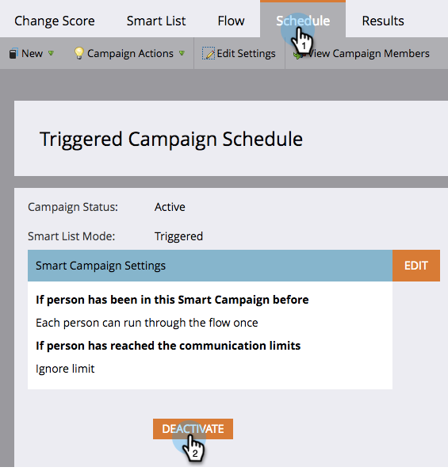

# Deaktivieren einer auslösenden intelligenten Kampagne | Registerkarte Plan {#deactivate-a-trigger-smart-campaign-schedule-tab}

Wenn Sie über eine alte Auslöser-Kampagne verfügen, die Sie deaktivieren müssen, führen Sie die folgenden Schritte aus:

1. Suchen und wählen Sie die aktive Auslöserfunktion aus.

   

1. Klicken Sie auf der Registerkarte Plan auf Deaktivieren.

   

1. Bestätigen Sie dies, indem Sie auf Deaktivieren klicken.

   

>[!NOTE]
>
>Dadurch wird verhindert, dass *neue* Personen in den Fluss gelangen, aber Personen, die sich in Warteschritten oder einem anderen Flussschritt befinden, durchlaufen den Fluss, bis sie fertig sind.

