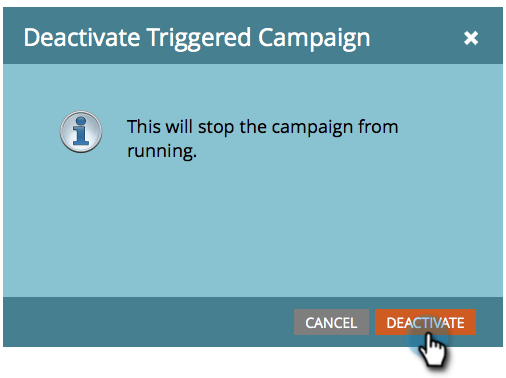

# Deaktivieren einer intelligenten Auslöser-Kampagne | Registerkarte „Zeitplan“ {#deactivate-a-trigger-smart-campaign-schedule-tab}

Wenn Sie eine alte Trigger-Kampagne haben, die Sie deaktivieren müssen, führen Sie die folgenden Schritte aus:

1. Suchen und wählen Sie Ihre aktive Trigger-Kampagne.

   

1. Klicken Sie auf der Registerkarte Zeitplan auf **[!UICONTROL Deaktivieren]**.

   

1. Bestätigen Sie mit **[!UICONTROL Deaktivieren]**.

   

>[!NOTE]
>
>Dadurch werden _neue_ Personen daran gehindert, in den Fluss einzutreten, aber Personen in Warteschritten oder anderen Flussschritten bewegen sich weiterhin durch den Fluss, bis sie fertig sind.
