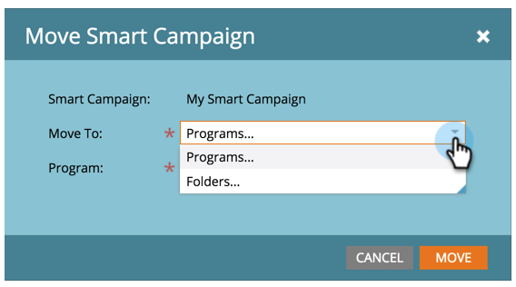

# Verschieben einer Smart-Kampagne {#move-a-smart-campaign}

Verschieben Sie eine intelligente Kampagne zwischen verschiedenen Programmen oder Ordnern mithilfe von Drag &amp; Drop oder der Funktion zum Verschieben in der Struktur.

## Drag &amp; Drop {#use-drag-and-drop}

1. Gehen Sie zu **Marketing-Aktivitäten**.

   

1. Wählen Sie die intelligente Kampagne aus und ziehen Sie sie in ein neues Programm.

   

   Fantastisch! Diese kluge Kampagne befindet sich jetzt in einem neuen Programm. Dies funktioniert auch bei Ordnern.

   >[!NOTE]
   >
   >Die Regeln Ihrer intelligenten Kampagne werden sich nicht ändern - sie werden einfach an einem anderen Ort verschachtelt.

## Funktion &quot;Verschieben&quot;{#use-the-move-feature} verwenden

Intelligente Kampagnen können auch mithilfe der Verschiebungsfunktion in der Struktur verschoben werden.

1. Klicken Sie mit der rechten Maustaste auf die intelligente Kampagne. Wählen Sie **Verschieben**.

   

1. Wählen Sie zwischen dem Wechsel zu einem **Programm** oder einem **Ordner**.

   

1. Wählen Sie die gewünschte Stelle für die zu verschiebende intelligente Kampagne aus.

   

1. Klicken Sie auf **Verschieben**.

   

   Hoch fünf! Diese intelligente Kampagne wurde verschoben.

   
