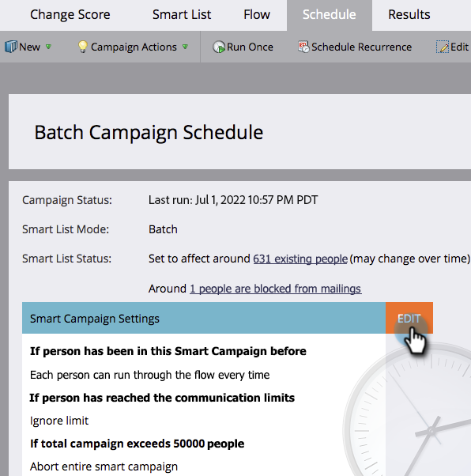

# Überschreiben von Personenbeschränkungen in einer intelligenten Kampagne {#override-person-restrictions-in-a-smart-campaign}

Beim Marketo Engage können Sie die maximale Anzahl an Personen festlegen, die sich für eine Smart-Kampagne qualifizieren können. So vermeiden Sie, dass Sie versehentlich eine E-Mail an Ihre gesamte Datenbank senden. Wenn Sie diese _außer Kraft setzen_, sehen Sie wie folgt aus:

>[!PREREQUISITES]
>
>Stellen Sie sicher, dass Sie [Personenbeschränkungen für Smart-Kampagnen aktivieren](/help/marketo/product-docs/administration/email-setup/enable-person-restrictions-for-smart-campaigns.md){target="_blank"} in Marketo Admin auswählen.

1. Gehen Sie **[!UICONTROL Marketing]** Aktivitäten) zu Ihrer Smart-Kampagne und klicken Sie auf **[!UICONTROL Zeitplan]**.

   

1. Klicken Sie in den Einstellungen für intelligente Kampagnen auf **[!UICONTROL Bearbeiten]**.

   

   >[!NOTE]
   >
   >Das Standardlimit ist dasjenige, das in Admin festgelegt ist.

1. Geben Sie ein neues Limit ein und klicken Sie auf **[!UICONTROL Speichern]**.

   

   Die intelligente Kampagne wird nicht ausgeführt, wenn die Anzahl der Personen, die sich qualifizieren, das festgelegte Limit überschreitet.

   >[!CAUTION]
   >
   >Seien Sie bei dieser Funktion vorsichtig, damit Sie nicht versehentlich zu viele Personen einbeziehen.
