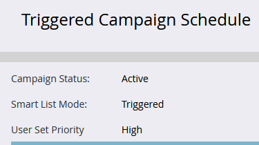

# Überschreiben der Priorität für Auslöser-Kampagnen {#priority-override-for-trigger-campaigns}

Administratoren können die in Marketo Engage festgelegte Priorität für Trigger-Kampagnen außer Kraft setzen, um Prioritäten zu setzen, die besser auf Geschäftsziele abgestimmt sind.

>[!NOTE]
>
>Diese Funktion ist nur für Trigger-Kampagnen und für Benutzende verfügbar, denen die [&#x200B; &quot;Trigger-Kampagnenpriorität bearbeiten“ gewährt &#x200B;](#grant-priority-override-access).

>[!CAUTION]
>
>Es wird dringend empfohlen, diese Funktion in einer begrenzten Anzahl geschäftskritischer Kampagnen zu verwenden (maximal 25 wird empfohlen). Die lockere Verwendung der Funktion auf einer großen Menge kann sich negativ auf die gesamte Kampagnenausführung auswirken.

## Zugriff auf Prioritätsüberschreibungen gewähren {#grant-priority-override-access}

>[!NOTE]
>
>Nur Admins oder Benutzende mit Admin-Zuständigkeiten sollten Zugriff auf die Kampagnenprioritätsüberschreibungen haben.

1. Klicken Sie im **[!UICONTROL Admin]**-Bereich auf **[!UICONTROL Benutzer und Rollen]**.

   

1. Klicken Sie auf die **[!UICONTROL Rollen]**, wählen Sie den Benutzer aus, dem Sie Zugriff gewähren möchten, und klicken Sie dann auf **[!UICONTROL Rolle bearbeiten]**.

   

1. Wählen **[!UICONTROL unter „Marketing-Aktivitäten]**&quot; die Option **[!UICONTROL Trigger-Kampagnenpriorität bearbeiten]** aus. Klicken Sie auf **[!UICONTROL Speichern]**.

   

## Priorität aufheben {#override-priority}

1. Suchen Sie Ihren Trigger Campaign. Klicken Sie mit der rechten Maustaste darauf und wählen Sie **[!UICONTROL Kampagnenpriorität überschreiben]**.

   

1. Klicken Sie auf den **[!UICONTROL Kampagnenpriorität überschreiben]**, um ihn zu aktivieren. Wählen Sie eine neue Prioritätsstufe aus und klicken Sie auf **[!UICONTROL Bestätigen]**.

   

   Die neue Prioritätsstufe wird auf der Registerkarte **[!UICONTROL Zeitplan]** angezeigt.

   

>[!NOTE]
>
>* Sie können die Standardpriorität Ihrer Kampagne in der [!UICONTROL Kampagnenwarteschlange“ unter &#x200B;]Marketing[!UICONTROL Aktivitäten) &#x200B;]. Um die Ausführungsrate zu erhöhen, empfehlen wir, die Kampagnenpriorität eine Ebene höher als die Standardpriorität festzulegen.
>* Die Priorität für Benutzereinstellungen gilt nur für neue Personen, die sich für die Kampagne qualifizieren. Personen, die sich bereits in der Warteschlange befinden, sind davon nicht betroffen.
>* Prioritätsüberschreibungen werden im [Audit-Protokoll](/help/marketo/product-docs/administration/audit-trail/audit-trail-overview.md){target="_blank"} erfasst.
