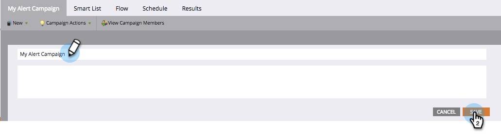

# Umbenennen einer intelligenten Kampagne {#rename-a-smart-campaign}

Sie können den Namen einer vorhandenen intelligenten Kampagne ändern. So geht es.

1. Gehen Sie zu Marketing-Aktivitäten.

   

1. Wählen Sie Ihre Smart-Kampagne aus und klicken Sie dann auf deren Namen.

   

   >[!TIP]
   >
   >Intelligente Kampagnen innerhalb von Programmen werden immer in das Format &quot;ProgramName.CampaignName&quot;übersetzt.

1. Geben Sie den Namen der neuen intelligenten Kampagne ein und klicken Sie auf Speichern.

   

   >[!NOTE]
   >
   >Der alte Name ist auf der Registerkarte sichtbar und ändert sich beim Speichern.

Schnell und einfach! Überall, wo auf die intelligente Kampagne verwiesen wird, wird auch geändert.