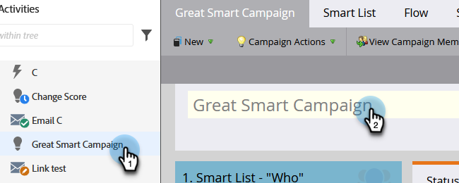

# Umbenennen einer intelligenten Kampagne {#rename-a-smart-campaign}

Sie können den Namen einer vorhandenen Smart-Kampagne ändern. Und so geht das.

1. Navigieren Sie **[!UICONTROL Marketing-Aktivitäten]**.

   

1. Wählen Sie Ihre Smart-Kampagne aus und klicken Sie dann rechts auf den Namen.

   

   >[!TIP]
   >
   >Namen für intelligente Kampagnen in Programmen werden immer in das Format „ProgramName.CampaignName“ übersetzt.

1. Geben Sie den neuen Smart-Kampagnennamen ein und klicken Sie auf **[!UICONTROL Speichern]**.

   

   >[!NOTE]
   >
   >Der alte Name ist auf der Registerkarte sichtbar und ändert sich beim Speichern.

Schnell und einfach! Die Stelle, an der die Smart Campaign referenziert wird, wird ebenfalls geändert.
