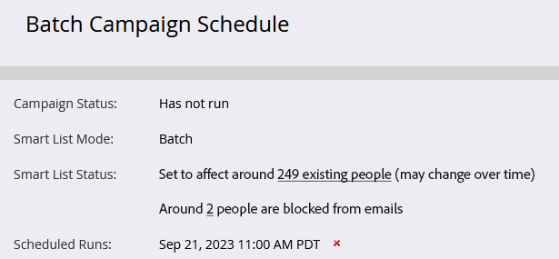

# Planen der Ausführung einer intelligenten Stapel-Kampagne zu einem späteren Zeitpunkt {#schedule-a-batch-smart-campaign-to-run-later}

Wenn Sie möchten, dass eine Batch-Kampagne zu einem späteren Zeitpunkt ausgeführt wird, sehen Sie folgendes.

>[!TIP]
>
>Sie können auch [eine Smart-Batch-Kampagne in der Ansicht Programmzeitplan neu planen](/help/marketo/product-docs/core-marketo-concepts/programs/program-schedule-view/reschedule-a-batch-smart-campaign-in-the-program-schedule-view.md){target="_blank"}.

1. Wählen Sie die Smart-Batch-Kampagne aus, die Sie ausführen möchten, wechseln Sie zur Registerkarte **[!UICONTROL Zeitplan]** und klicken Sie auf **[!UICONTROL Einmal ausführen]**.

   

1. Klicken Sie **[!UICONTROL Später ausführen]**, klicken Sie dann auf das Kalendersymbol und wählen Sie den Tag aus, an dem die Smart-Kampagne ausgeführt werden soll.

   

1. Wählen Sie die Zeit aus, zu der die Smart-Kampagne ausgeführt werden soll (mindestens 15 Minuten).

   

1. Klicken Sie auf **[!UICONTROL Speichern]**.

   

1. Sie können die geplante Ausführung auf der Registerkarte **[!UICONTROL Zeitplan]** bestätigen.

   

   >[!NOTE]
   >
   >[Planen einer wiederkehrenden Batch-Kampagne](/help/marketo/product-docs/core-marketo-concepts/smart-campaigns/using-smart-campaigns/schedule-a-recurring-batch-campaign.md){target="_blank"}
