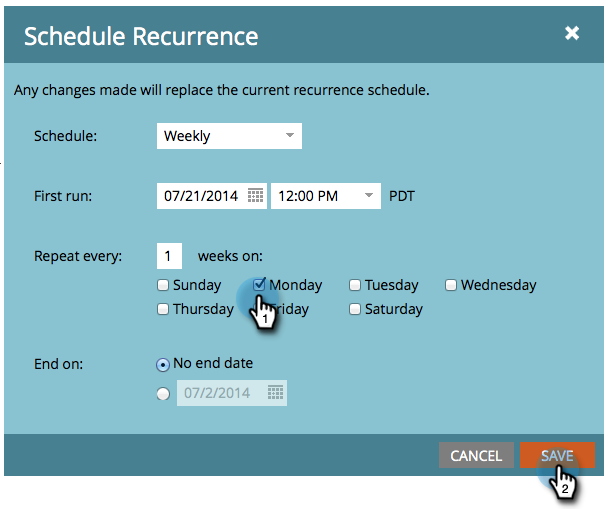

# Eine wiederkehrende Batch-Kampagne {#schedule-a-recurring-batch-campaign} planen

Mit der Wiederholung können Sie eine intelligente Batch-Kampagne regelmäßig ausführen. Zum Beispiel - einmal pro Woche, Montag um 22:00 Uhr.

1. Wählen Sie die Kampagne aus, gehen Sie zur Registerkarte Plan und klicken Sie auf Wiederholung planen.

   

1. Klicken Sie auf die Dropdownliste Plan und wählen Sie Wöchentlich aus.

   

1. Klicken Sie auf das Kalendersymbol und wählen Sie den Tag für die erste Ausführung aus. Für dieses Beispiel verwenden wir den nächsten verfügbaren Montag.

   

1. Wählen Sie die Zeit aus, zu der sie ausgeführt werden soll.

   

1. Lassen Sie &quot;Wiederholen&quot;alle 1, wählen Sie &quot;Montag&quot;und klicken Sie auf &quot;Speichern&quot;.

   

1. Sie können die geplanten Wiederholungen auf der Registerkarte &quot;Plan&quot;zur Überprüfung sehen.

   

>[!NOTE]
>
>Auf der Registerkarte &quot;Plan&quot;werden die folgenden drei Vorkommen als Referenz angezeigt.

Und das ist es! Ihre Batch-Kampagne wird nun jeden Montag um Mittag ausgeführt.