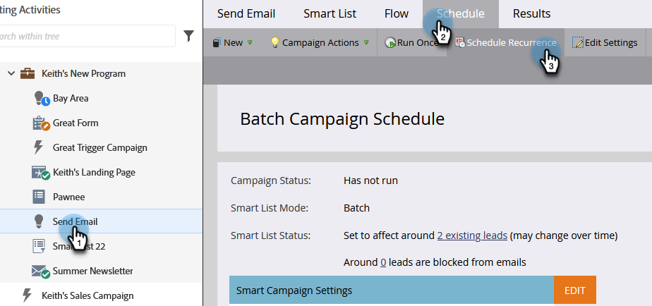
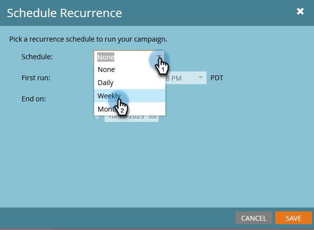

# Planen einer wiederkehrenden Stapel-Kampagne {#schedule-a-recurring-batch-campaign}

Die Wiederholung ermöglicht Ihnen, eine Batch-Kampagne nach einem regulären Zeitplan auszuführen. Zum Beispiel - einmal pro Woche, dienstags um 10:00 Uhr.

1. Wählen Sie die intelligente Kampagne aus, wechseln Sie zur Registerkarte **[!UICONTROL Zeitplan]** und klicken Sie auf **[!UICONTROL Intervall planen]**.

   

1. Klicken Sie auf **[!UICONTROL Zeitplan]** und wählen Sie &quot;**[!UICONTROL &quot;]**.

   

1. Klicken Sie auf das Kalendersymbol und wählen Sie den gewünschten Tag für die erste Ausführung aus.

   

1. Wählen Sie den Zeitpunkt aus, zu dem er ausgeführt werden soll.

   

1. Belassen Sie [!UICONTROL Wiederholen alle] den Wert 1, wählen Sie Dienstag aus und klicken Sie auf **[!UICONTROL Speichern]**.

   

   >[!NOTE]
   >
   >Klicken Sie für eine bestimmte Ausführungsdauer auf das Kalendersymbol neben **[!UICONTROL Ende am]** und wählen Sie das Enddatum aus.

Die geplanten Wiederholungen werden unten auf der Registerkarte Zeitplan angezeigt.

>[!NOTE]
>
>Auf der Registerkarte Planung werden die nächsten drei Termine als Referenz angezeigt. Durch Klicken auf das rote **X** wird diese Ausführung abgebrochen.
