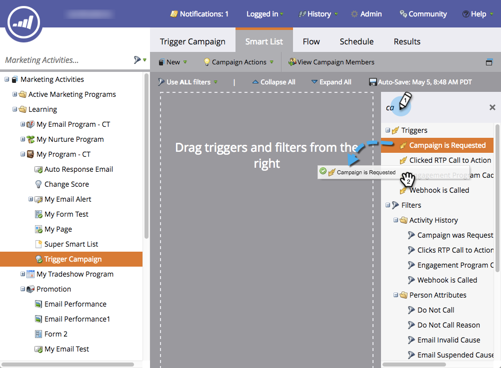

# Einrichten einer auslösenden intelligenten Kampagne für den Vertrieb mithilfe von &quot;Kampagne ist angefordert&quot; {#setting-up-a-trigger-smart-campaign-for-sales-using-campaign-is-requested}

Eines der coolsten Merkmale von Marketo ist die Fähigkeit, Verkaufspersonal an den Marketingbemühungen teilnehmen zu lassen. Sie sind an der Front und interagieren mit Leuten. Vertriebsmitarbeiter sollten in der Lage sein, Marketing in die richtige Richtung zu lenken.

>[!NOTE]
>
>**Beispiel**
>
>Beispiele für anzufordernde intelligente Kampagnen:
>
>1. **Langfristige Pflege**  - wenn sie in diesem Jahr kein Budget haben und Sie einfach auf dem Radar bleiben wollen
>1. **Aktiver Verkaufszyklus**  - wenn der Verkäufer keine Nachrichten an die Person mit Ausnahme seiner eigenen möchte. (verwenden Sie die Markierung für die ausgesetzte Vermarktung, um sie vorübergehend abzumelden)

>
>
Sei kreativ! Was soll der Verkäufer automatisieren? Fragen Sie sie einfach und verbinden Sie es!

1. Erstellen Sie eine **Smart-Kampagne.**

   

1. Suchen und ziehen Sie **Kampagne** **ist** **Angefordert **auf die Arbeitsfläche.

   

1. Die Quellauswahl gibt an, welche Art von Anforderung berücksichtigt wird. Wählen Sie für die Salesforce-Funktionalität **Sales** **Insight**.

   >[!TIP]
   >
   >Die Quelloperatoren dienen der Sicherheit. Sie können die Kampagne auf Anforderungen beschränken, die nur von bestimmten Quellen wie anderen intelligenten Kampagnen oder Entwicklern ausgeführt werden. Wählen Sie **Ist Beliebig** im ersten Feld, wenn Sie Anforderungen aus allen Quellen zulassen möchten.
   >
   >
   >**Denken Sie daran**, dass es durch Auswahl von Sales Insight auf magische Weise in der Box für Verkäufe angezeigt wird. Übertreibe es nicht! Zu viele werden von ihnen ignoriert.

   

Dies ist eine großartige Möglichkeit, Ihre Marketing-Reichweite auf andere Abteilungen auszudehnen. Richten Sie alle möglichen Kampagnen ein, um sie zu automatisieren.

>[!TIP]
>
>Vergiss nicht, deine klugen Kampagnen klar zu benennen! Sie werden in Sales Insight genau wie Sie sie benennen.

