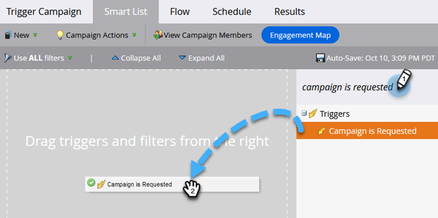

# Einrichten einer intelligenten Auslöser-Kampagne für den Verkauf mit „Kampagne wurde angefordert“ {#setting-up-a-trigger-smart-campaign-for-sales-using-campaign-is-requested}

Eine der coolsten Funktionen von Marketo ist die Möglichkeit, Vertriebsmitarbeiter an den Marketingmaßnahmen teilnehmen zu lassen. Sie stehen an vorderster Front und interagieren mit Menschen. Vertriebsmitarbeiter sollten in der Lage sein, das Marketing in die richtige Richtung zu lenken.

>[!NOTE]
>
>Beispiele für anzufragende Smart-Kampagnen:
>
>1. **Langfristige Pflege** - wenn sie in diesem Jahr kein Budget haben und man einfach auf dem Radar bleiben möchte
>1. **Aktiver Verkaufszyklus** - wenn der Verkäufer keine Nachrichten an die Person senden möchte, mit Ausnahme seiner eigenen. (Verwenden Sie die Markierung Marketing ausgesetzt , um das Abonnement vorübergehend zu kündigen.)
>
>Seien Sie kreativ! Was möchte der Vertriebsmitarbeiter automatisieren? Fragen Sie sie einfach und verkabeln Sie sie!

1. Erstellen Sie eine intelligente Kampagne.

   

1. Suchen Sie den Trigger **[!UICONTROL Kampagne ist angefordert]** und ziehen Sie ihn auf die Arbeitsfläche.

   

1. Die Quellenauswahl gibt an, welche Art von Anfrage berücksichtigt wird. Wählen Sie für die Salesforce-Funktionen **[!UICONTROL Sales Insight]**.

   >[!TIP]
   >
   >Die Quelloperatoren dienen der Sicherheit. Sie können die Kampagne auf Anfragen beschränken, die nur von bestimmten Quellen, wie anderen intelligenten Kampagnen oder Entwicklern, gestellt werden. Wählen Sie **[!UICONTROL Ist Beliebig]** im ersten Feld aus, wenn Sie Anfragen aus allen Quellen zulassen möchten.
   >
   >_Denken Sie_, wenn Sie sich für Sales Insight entscheiden, wird es auf magische Weise in der Box für den Vertrieb angezeigt. Übertreib&#39;s nicht. Zu viele werden von ihnen ignoriert.

   

Dies ist eine hervorragende Möglichkeit, Ihre Marketing-Reichweite auf andere Abteilungen auszudehnen. Richten Sie alle Arten von Kampagnen zur Automatisierung ein.

>[!TIP]
>
>Vergessen Sie nicht, Ihre Smart-Kampagnen klar zu benennen. Sie werden in Sales Insight genau so angezeigt, wie Sie sie nennen.
