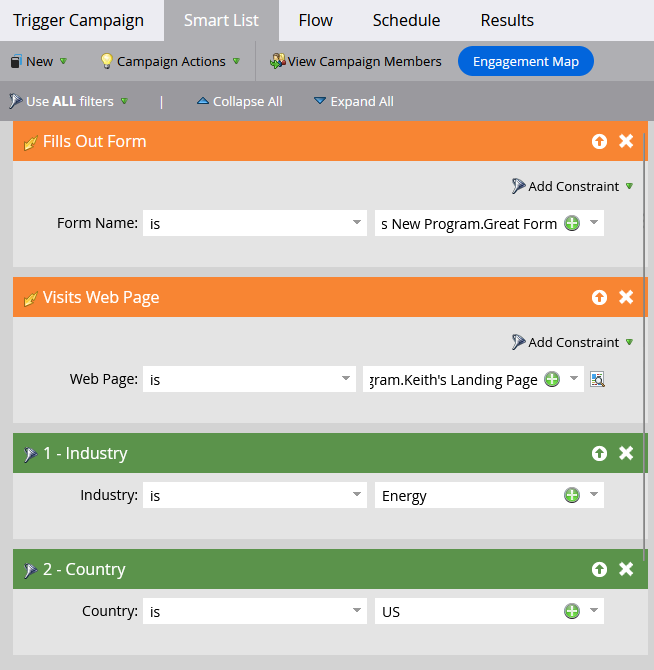

# Verwenden der standardmäßigen Regellogik für intelligente Listen {#using-standard-smart-list-rule-logic}

Ihnen ist möglicherweise die Option „Filter verwenden“ beim Erstellen von Smart Lists für Kampagnen aufgefallen. Mit dieser Einstellung können Sie entscheiden, ob die Filter mit einem AND- oder einem OR-Operator ausgewertet werden müssen.


>[!NOTE]
>
>Das Ändern der Regellogik der Smart List gilt nur für Filter, _nicht für_.

Trigger werden immer als ODER ausgewertet, selbst wenn die obige Einstellung auf ALL festgelegt ist. Beispiel:



Die obige Smart-Liste in Worten:

```box
IF person fills out Great Form
OR
IF person visits Keith's Landing Page
AND
Industry is Energy
AND
Country is US
THEN follow the campaign's flow step(s)
```

Wenn also eine Person das Formular ausfüllt _oder_ die Seite besucht, bewertet die Kampagne diese Person basierend auf _allen_ oder __ nachfolgenden Filtern, je nach der verwendeten Einstellung.

>[!MORELIKETHIS]
>
>[Verwenden der erweiterten Regellogik für Smart List](/help/marketo/product-docs/core-marketo-concepts/smart-lists-and-static-lists/using-smart-lists/using-advanced-smart-list-rule-logic.md){target="_blank"}
