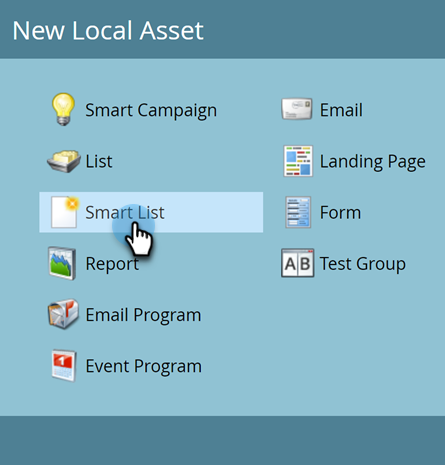

# Erstellen einer intelligenten Liste {#create-a-smart-list}

Mit Smart Lists können Sie mithilfe einfacher Filter bestimmte Personengruppen finden. So wird eine erstellt.

1. Navigieren Sie **[!UICONTROL Marketing-Aktivitäten]**.

   

1. Wählen Sie das Programm aus, in dem Sie die Smart-Liste erstellen möchten.

   

1. Klicken **[!UICONTROL unter „Neu]** auf **[!UICONTROL Neues lokales Asset]**.

   

1. Wählen Sie **[!UICONTROL Smart-Liste]** aus.

   

1. Geben Sie einen **[!UICONTROL Namen]** ein und klicken Sie auf **[!UICONTROL Erstellen]**.

   

   Ta-da, großartige Arbeit! Fügen wir nun einige Filter hinzu und definieren wir sie.

   >[!MORELIKETHIS]
   >
   >[Filter suchen und zu einer Smart-Liste hinzufügen](/help/marketo/product-docs/core-marketo-concepts/smart-lists-and-static-lists/creating-a-smart-list/find-and-add-filters-to-a-smart-list.md){target="_blank"}
