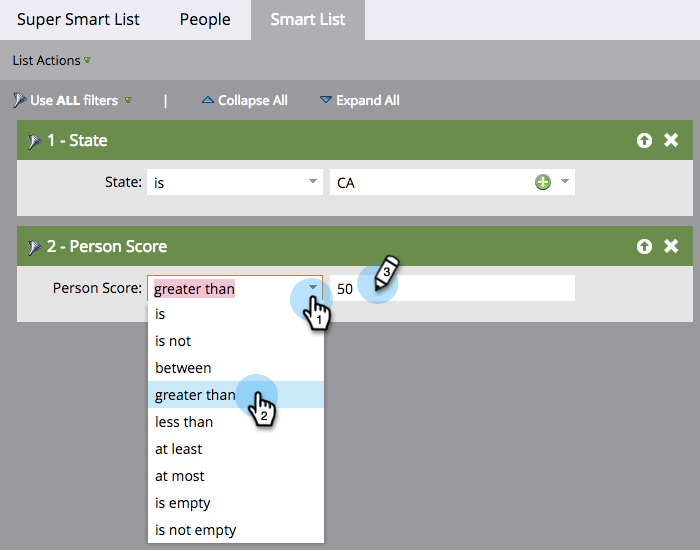

# Definieren von Smart-List-Filtern {#define-smart-list-filters}

>[!PREREQUISITES]
>
>* [Erstellen einer Smart-Liste](/help/marketo/product-docs/core-marketo-concepts/smart-lists-and-static-lists/creating-a-smart-list/create-a-smart-list.md){target="_blank"}
>* [Filter zu Smart-Listen suchen und hinzufügen](/help/marketo/product-docs/core-marketo-concepts/smart-lists-and-static-lists/creating-a-smart-list/find-and-add-filters-to-a-smart-list.md){target="_blank"}

Nachdem Sie [eine Smart-Liste](/help/marketo/product-docs/core-marketo-concepts/smart-lists-and-static-lists/creating-a-smart-list/create-a-smart-list.md){target="_blank"} erstellt und [Filter](/help/marketo/product-docs/core-marketo-concepts/smart-lists-and-static-lists/creating-a-smart-list/find-and-add-filters-to-a-smart-list.md){target="_blank"} hinzugefügt haben, legen wir die Filter fest. So geht es.

Lassen Sie uns in unserem Beispiel diese Filter definieren, um alle Menschen in Kalifornien mit einer Punktzahl über 50 zu finden.

1. Wechseln Sie zu **[!UICONTROL Marketingaktivitäten]**.

   

1. Wählen Sie die gewünschte Smart-Liste aus und klicken Sie auf die Registerkarte **[!UICONTROL Smart-Liste]** .

   

1. Suchen und wählen Sie &quot;CA&quot;für den Filter **[!UICONTROL Status]** aus.

   

   >[!NOTE]
   >
   >Möglicherweise speichern Sie sowohl &quot;Kalifornien&quot;als auch &quot;CA&quot;. Um nach beiden Werten zu filtern und _alle_ Personen aus Kalifornien einzubeziehen, erfahren Sie, wie Sie [mehrere Werte zu einem Smart-List-Filter hinzufügen](/help/marketo/product-docs/core-marketo-concepts/smart-lists-and-static-lists/using-smart-lists/add-multiple-values-to-a-smart-list-filter.md){target="_blank"}.

1. Wählen Sie den Operator **[!UICONTROL größer als]** aus und geben Sie &quot;50&quot;ein.

   

>[!TIP]
>
>Wenn Sie glauben, dass Ihre Datenbank Datensätze enthält, die unvollständige E-Mail-Adressen enthalten (z. B. &quot;@adobe.com&quot;), verwenden Sie bei Verwendung des Operators &quot;enthält&quot; zwei Filter für E-Mail-Adressen. Ein Filter mit &quot;enthält @adobe.com&quot;und ein separater Filter mit &quot;enthält adobe.com&quot;(ohne das @-Symbol).

Jetzt wissen Sie, wie Sie eine Smart-Liste erstellen und Filter hinzufügen/definieren.
