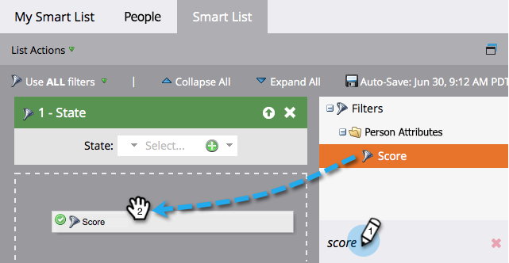

# Suchen und Hinzufügen von Filtern zu einer Smart-Liste {#find-and-add-filters-to-a-smart-list}

Nachdem Sie [Smart-Liste“ erstellt haben](/help/marketo/product-docs/core-marketo-concepts/smart-lists-and-static-lists/creating-a-smart-list/create-a-smart-list.md){target="_blank"} müssen Sie Filter hinzufügen und [definieren](/help/marketo/product-docs/core-marketo-concepts/smart-lists-and-static-lists/creating-a-smart-list/define-smart-list-filters.md){target="_blank"}. Im Folgenden erfahren Sie, wie Sie Filter finden und hinzufügen.

In diesem Beispiel wollen wir alle Menschen in Kalifornien mit einem Ergebnis über 50 finden.

>[!TIP]
>
>Erkunden Sie den Baum auf der rechten Seite - Filter sind sehr leistungsstark und haben eine Vielzahl von möglichen Funktionen.

1. Navigieren Sie **[!UICONTROL Marketing-Aktivitäten]**.

   

1. Wählen Sie die Smart-Liste aus, der Sie Filter hinzufügen möchten, und klicken Sie auf die Registerkarte **[!UICONTROL Smart-Liste]**.

   

1. Suchen Sie den Filter **[!UICONTROL Status]** und ziehen Sie ihn auf die Arbeitsfläche.

   

1. Suchen Sie auch den Filter **[!UICONTROL Score]** und ziehen Sie ihn dorthin.

   

Perfekt! Fahren wir fort und definieren Sie diese Filter.

>[!MORELIKETHIS]
>
>* [Erstellen einer Smart-Liste](/help/marketo/product-docs/core-marketo-concepts/smart-lists-and-static-lists/creating-a-smart-list/create-a-smart-list.md){target="_blank"}
>* [Definieren von Smart-Listen-Filtern](/help/marketo/product-docs/core-marketo-concepts/smart-lists-and-static-lists/creating-a-smart-list/define-smart-list-filters.md){target="_blank"}
