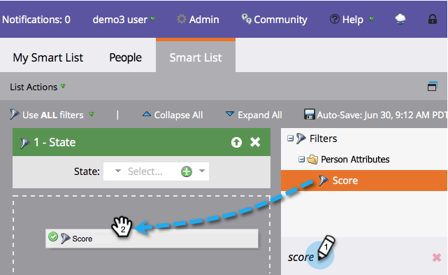

# Suchen und Hinzufügen von Filtern zu einer Smart-Liste {#find-and-add-filters-to-a-smart-list}

Sobald du [Smart List erstellt](/help/marketo/product-docs/core-marketo-concepts/smart-lists-and-static-lists/creating-a-smart-list/create-a-smart-list.md){target="_blank"}, you need to add and [define](/help/marketo/product-docs/core-marketo-concepts/smart-lists-and-static-lists/creating-a-smart-list/define-smart-list-filters.md){target="_blank"} Filter. So können Sie Filter finden und hinzufügen.

In diesem Beispiel finden wir alle Menschen in Kalifornien mit einer Punktzahl über 50.

>[!TIP]
>
>Erkunden Sie den Baum auf der rechten Seite - Filter sind sehr leistungsstark und haben eine Vielzahl von Funktionen.

1. Navigieren Sie zu **[!UICONTROL Marketingaktivitäten]**.

   

1. Wählen Sie die Smart-Liste aus, der Sie Filter hinzufügen möchten, und klicken Sie auf die Schaltfläche **[!UICONTROL Smart List]** Registerkarte.

   

1. Suchen und Ziehen **[!UICONTROL Bundesland]** auf die Arbeitsfläche.

   

1. Suchen und ziehen Sie außerdem **[!UICONTROL Ergebnis]** nach.

   

Perfekt! Definieren wir diese Filter.

>[!MORELIKETHIS]
>
>* [Erstellen einer Smart-Liste](/help/marketo/product-docs/core-marketo-concepts/smart-lists-and-static-lists/creating-a-smart-list/create-a-smart-list.md){target="_blank"}
>* [Definieren von Smart-List-Filtern](/help/marketo/product-docs/core-marketo-concepts/smart-lists-and-static-lists/creating-a-smart-list/define-smart-list-filters.md){target="_blank"}
