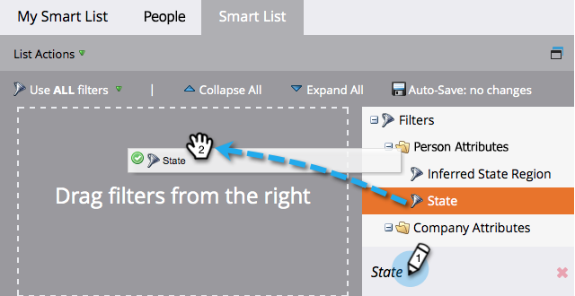

# Suchen und Hinzufügen von Filtern zu einer Smart-Liste {#find-and-add-filters-to-a-smart-list}

Nachdem Sie [eine Smart-Liste](/help/marketo/product-docs/core-marketo-concepts/smart-lists-and-static-lists/creating-a-smart-list/create-a-smart-list.md){target="_blank"} erstellt haben, müssen Sie Filter hinzufügen und [definieren](/help/marketo/product-docs/core-marketo-concepts/smart-lists-and-static-lists/creating-a-smart-list/define-smart-list-filters.md){target="_blank"}. So können Sie Filter finden und hinzufügen.

In diesem Beispiel finden wir alle Menschen in Kalifornien mit einer Punktzahl über 50.

>[!TIP]
>
>Erkunden Sie den Baum auf der rechten Seite - Filter sind sehr leistungsstark und haben eine Vielzahl von Funktionen.

1. Wechseln Sie zu **[!UICONTROL Marketingaktivitäten]**.

   

1. Wählen Sie die Smart-Liste aus, der Sie Filter hinzufügen möchten, und klicken Sie auf die Registerkarte **[!UICONTROL Smart-Liste]** .

   

1. Suchen und ziehen Sie den Filter **[!UICONTROL Status]** auf die Arbeitsfläche.

   

1. Suchen Sie außerdem den Filter **[!UICONTROL Punktzahl]** und ziehen Sie ihn darüber.

   

Perfekt! Definieren wir diese Filter.

>[!MORELIKETHIS]
>
>* [Erstellen einer Smart-Liste](/help/marketo/product-docs/core-marketo-concepts/smart-lists-and-static-lists/creating-a-smart-list/create-a-smart-list.md){target="_blank"}
>* [Definieren von Smart-List-Filtern](/help/marketo/product-docs/core-marketo-concepts/smart-lists-and-static-lists/creating-a-smart-list/define-smart-list-filters.md){target="_blank"}
