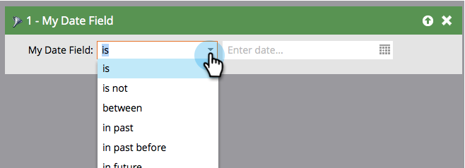

# Glossar der Filteroperatoren für intelligente Listen {#smart-list-filter-operators-glossary}

Ein Operator ist Teil der Smart-Liste, mit der Sie bestimmte Funktionen festlegen können. Damit können Sie Ihren Filter oder Trigger in einfacher Sprache beschreiben. Die verfügbaren Operatoren sind für jeden Feldtyp unterschiedlich.

Im Folgenden finden Sie ein Glossar, in dem die einzelnen Benutzergruppen beschrieben werden.

## Datumsfelder {#date-fields}

Wenn Sie einen Operator wählen, ändert sich die rechte Seite dynamisch.

<table><thead>
  <tr>
    <th>Benutzerin oder Benutzer</th>
    <th>Rechte Seite</th>
    <th>Beschreibung</th>
  </tr></thead>
<tbody>
  <tr>
    <td>ist</td>
    <td>Einzelnes Datum</td>
    <td>Exakter Übereinstimmungstermin</td>
  </tr>
  <tr>
    <td>ist nicht</td>
    <td>Einzelnes Datum</td>
    <td>Beliebiges Datum AUSSER dem angegebenen</td>
  </tr>
  <tr>
    <td>zwischen</td>
    <td>Zwei Datumsfelder</td>
    <td>Beliebiges Datum, einschließlich und zwischen zwei angegebenen Daten</td>
  </tr>
  <tr>
    <td>in Vergangenheit</td>
    <td>Eingabe natürlicher Sprache*</td>
    <td>Siehe Diagramm unten</td>
  </tr>
  <tr>
    <td>in der Vergangenheit vor</td>
    <td>Eingabe natürlicher Sprache*</td>
    <td>Siehe Diagramm unten</td>
  </tr>
  <tr>
    <td>in der Zukunft</td>
    <td>Eingabe natürlicher Sprache*</td>
    <td>Siehe Diagramm unten</td>
  </tr>
  <tr>
    <td>in der Zukunft nach</td>
    <td>Eingabe natürlicher Sprache*</td>
    <td>Siehe Diagramm unten</td>
  </tr>
  <tr>
    <td>in Zeitrahmen</td>
    <td>Voreinstellungen (letztes Quartal, gestern usw.)</td>
    <td>In Auswahlliste definiert</td>
  </tr>
  <tr>
    <td>nach</td>
    <td>Einzelnes Datum</td>
    <td>Alle Datensätze nach dem angegebenen Datum</td>
  </tr>
  <tr>
    <td>vor</td>
    <td>Einzelnes Datum</td>
    <td>Alle Datensätze vor dem angegebenen</td>
  </tr>
  <tr>
    <td>am oder nach</td>
    <td>Einzelnes Datum</td>
    <td>Wie „nachher“, aber inklusiv</td>
  </tr>
  <tr>
    <td>Am oder vor</td>
    <td>Einzelnes Datum</td>
    <td>Wie „vorher“, aber inklusiv</td>
  </tr>
  <tr>
    <td>ist leer</td>
    <td>Keine</td>
    <td>Alle Datensätze ohne Datum</td>
  </tr>
  <tr>
    <td>ist nicht leer</td>
    <td>Keine</td>
    <td>Alle Datensätze mit beliebigem Datum</td>
  </tr>
</tbody></table>

**&#42;** Eingabe natürlicher Sprache ist cool. Im Folgenden finden Sie einige Muster, die Sie eingeben können:

* 1 Stunde
* 82 Tage
* 3 Wochen
* 14 Monate
* 1 Jahr

Geben Sie einfach die Nummer und die Einheit zusammen ein, und es funktioniert!

>[!NOTE]
>
>„In der Vergangenheit“ _umfasst_ den Tag (bis zum Zeitpunkt, nicht danach), an dem Sie Ihre Smart-Liste erstellen.

>[!CAUTION]
>
>Wenn Sie eine Smart-Liste mithilfe eines Datumsfeldfilters erstellen (z. B. Geburtsdatum, Erstellungsdatum von SFDC) und die Einschränkungen **[!UICONTROL vor]**, **[!UICONTROL am oder vor]** oder **[!UICONTROL in der Vergangenheit vor]** verwenden, enthält die Smart-Liste auch Personen, die in diesem Datumsfeld keinen Wert haben.

Verwenden Sie das folgende Diagramm, um den Unterschied zwischen den Datumsoperatoren zu verstehen.

>[!NOTE]
>
>**Beispiel**
>
>Datumsfelder können bei der Arbeit mit vergangenen und zukünftigen Ereignissen schwierig werden. Im Folgenden finden Sie einige Beispiele.
>
>**[!UICONTROL In der Vergangenheit vor]**
>
>Verwenden Sie für Ihre neue Promotion diesen Operator, um E-Mails nur an Personen zu senden, die sich nicht innerhalb eines Jahres angemeldet oder Ihren Service erneuert haben oder noch nie Abonnenten waren.
>
>**[!UICONTROL In Zukunft nach]**
>
>Angenommen, Sie möchten Kunden sehen, die in 90 Tagen für eine Verlängerung infrage kommen. Dazu würden Sie zwei separate Filter verwenden. Verwenden Sie zunächst „In der Zukunft nach 90 Tagen“ und dann „In der Zukunft nach 91 Tagen“. Das würde jeden erfassen, der in 90 Tagen ein Datum hat.

## Zeichenfolgenfelder {#string-fields}

<table><thead>
  <tr>
    <th>Benutzerin oder Benutzer</th>
    <th>Beschreibung</th>
  </tr></thead>
<tbody>
  <tr>
    <td>ist</td>
    <td>Exakte Übereinstimmung (Groß-/Kleinschreibung wird nicht beachtet)</td>
  </tr>
  <tr>
    <td>ist nicht</td>
    <td>Alles AUSSER exakter Übereinstimmung</td>
  </tr>
  <tr>
    <td>beginnt mit</td>
    <td>Erste Buchstaben der Zeichenfolgenübereinstimmung</td>
  </tr>
  <tr>
    <td>beginnt nicht mit</td>
    <td>Die ersten Buchstaben der Zeichenfolge stimmen NICHT überein</td>
  </tr>
  <tr>
    <td>enthält</td>
    <td>Alle Buchstaben zusammen in der Zeichenfolge (Beispiel: California, Fortune, deswegen)</td>
  </tr>
  <tr>
    <td>enthält nicht</td>
    <td>Keine Buchstaben in der Zeichenfolge übereinstimmen. (Umgekehrt zu „enthält„)</td>
  </tr>
  <tr>
    <td>ist leer</td>
    <td>Datensätze ohne Wert (NULL)</td>
  </tr>
  <tr>
    <td>ist nicht leer</td>
    <td>Datensätze mit BELIEBIGEN Werten</td>
  </tr>
</tbody>
</table>

>[!TIP]
>
>Verwenden Sie positive Operatoren gegenüber negativen Operatoren. Filter mit dem Status „Ist nicht“ müssen den gesamten Datensatz in Ihrer Instanz durchsuchen, was extrem zeitaufwendig sein kann. Positive „is“-Filter können effektivere Suchalgorithmen nutzen.

## Ganzzahlige Felder {#integer-fields}

<table><thead>
  <tr>
    <th>Benutzerin oder Benutzer</th>
    <th>Beschreibung</th>
  </tr></thead>
<tbody>
  <tr>
    <td>ist</td>
    <td>Exakte Zahlenübereinstimmung ( = 0 gibt beide Leads mit 0 und NULL zurück)</td>
  </tr>
  <tr>
    <td>ist nicht</td>
    <td>Alles AUSSER exakter Zahlenübereinstimmung</td>
  </tr>
  <tr>
    <td>zwischen</td>
    <td>Zwei Werte definieren, um alle dazwischen zu finden (einschließlich)</td>
  </tr>
  <tr>
    <td>größer als</td>
    <td>Über dem angegebenen Wert</td>
  </tr>
  <tr>
    <td>kleiner als</td>
    <td>Kleiner als der angegebene</td>
  </tr>
  <tr>
    <td>mindestens</td>
    <td>Oberhalb der angegebenen (einschließlich)</td>
  </tr>
  <tr>
    <td>höchstens</td>
    <td>Kleiner als angegeben (einschließlich)</td>
  </tr>
  <tr>
    <td>ist leer</td>
    <td>Datensätze ohne Wert (NULL) - Null ist eine Zahl, sie ist nicht NULL</td>
  </tr>
  <tr>
    <td>ist nicht leer</td>
    <td>Datensätze mit BELIEBIGEN Werten (einschließlich Null)</td>
  </tr>
</tbody>
</table>

Wie Sie sehen können, machen es diese Operatoren leicht, Marketo-Ese fließend zu sprechen!
