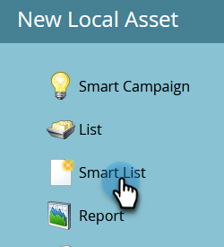
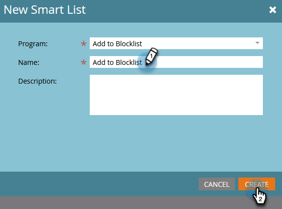
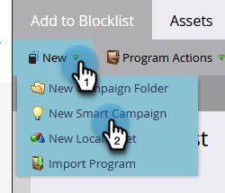

# Person zur Blockierungsliste hinzufügen {#add-person-to-blocklist}

Wenn Sie Personen zu Ihrer Blockierungsliste hinzufügen, können diese Ihre Korrespondenz nicht erhalten.

1. Erstellen Sie ein neues [Standardprogramm](/help/marketo/product-docs/core-marketo-concepts/programs/creating-programs/create-a-program.md){target="_blank"} und nennen Sie es „Zu Blockierungsliste hinzufügen“.

1. Klicken Sie auf **[!UICONTROL Neu]** und wählen Sie **[!UICONTROL Neues lokales Asset]**.

   

1. Wählen Sie **[!UICONTROL Smart-Liste]** aus.

   

1. Benennen Sie Ihre Liste und klicken Sie auf **[!UICONTROL Erstellen]**.

   

1. Fügen Sie alle Personen zu Ihrer Smart-Liste hinzu, die Sie Ihrer Blockierungsliste hinzufügen möchten.

   

   >[!NOTE]
   >
   >Personen auf Ihrer Blockierungsliste erhalten keine operativen E-Mails.

1. Gehen Sie zurück zu Ihrem Programm.

   

1. Klicken Sie auf **[!UICONTROL Neu]** und wählen Sie **[!UICONTROL Neue Smart-Kampagne]**.

   

1. Benennen Sie die neue Smart-Kampagne. Klicken Sie auf **[!UICONTROL Erstellen]**.

   

1. Drag-and-Drop **[!UICONTROL Mitglied der Smart-]**)

   

1. Wählen Sie die soeben erstellte Smart-Liste aus.

   

1. Klicken Sie auf **[!UICONTROL Registerkarte]** Fluss“. Ziehen Sie die Flussaktion **[!UICONTROL Datenwert ändern]** per Drag-and-Drop.

   

1. Wählen Sie in **[!UICONTROL Dropdown]** Attribut“ **[!UICONTROL Blockierungsliste]** aus und setzen Sie **[!UICONTROL Neuer Wert]** auf **[!UICONTROL true]**.

   

1. Klicken Sie auf die **[!UICONTROL Zeitplan]** und wählen Sie **[!UICONTROL Einmal ausführen]**.

   

1. Wählen Sie **[!UICONTROL Jetzt ausführen]** und klicken Sie auf **[!UICONTROL Ausführen]**.

   

1. Klicken Sie **[!UICONTROL erneut auf]** Ausführen“.

   

Diese Personen erhalten keine E-Mails mehr.

>[!TIP]
>
>Erstellen Sie eine [&#128279;](/help/marketo/product-docs/core-marketo-concepts/smart-campaigns/creating-a-smart-campaign/create-a-new-smart-campaign.md){target="_blank"}-Kampagne mit **Datenwert ändern** mit **Blockierungsliste ist wahr** für alle Personen in der Zukunft, die Attribut für eine Trigger auf die Blockierungsliste setzte haben.
