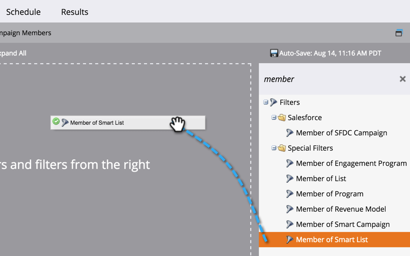
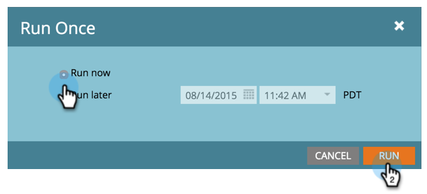

# Person zu Blockierungsliste hinzufügen {#add-person-to-blocklist}

Wenn Sie Personen zu Ihrer Blockierungsliste hinzufügen, wird verhindert, dass sie Ihre Korrespondenz erhalten.

>[!NOTE]
>
>Marketo ist dabei, Begriffe wie Blacklist und Whitelist zu Blockierungsliste und Zulassungsliste in unserem Produkt zu ändern. Während dieser Aktualisierung werden möglicherweise die alten Begriffe in unseren Screenshots der Benutzeroberfläche und Dokumentation sowie die neuen Begriffe in unserem Dokumentationstext angezeigt. Wir entschuldigen uns für jede Verwirrung.

1. [Neues Standardprogramm erstellen](/help/marketo/product-docs/core-marketo-concepts/programs/creating-programs/create-a-program.md) und benennen Sie sie **Zu Blockierungsliste hinzufügen**.

1. Klicks **Neu** und wählen **Neues lokales Asset**.

   

1. Benennen Sie Ihre Liste und klicken Sie auf **Erstellen**.

   

1. Fügen Sie alle Personen zu Ihren **Smart List** Sie möchten zu Ihrer Blockierungsliste hinzugefügt werden.

   >[!NOTE]
   >
   >Personen auf Ihrer Blockierungsliste erhalten keine operativen E-Mails.

   

1. Klicks **Neu** und wählen **Neue intelligente Kampagne**.

   

1. Benennen Sie die **Neue intelligente Kampagne**. Klicken Sie auf **Erstellen**.

   

1. Drag &amp; Drop **Mitglied der Smart List**.

   

1. Wählen Sie die soeben erstellte Smart-Liste aus.

   

1. Drag &amp; Drop **Datenwert ändern**.

   

1. Für **Fluss**, eingeben **Block Listed** für die **Attribut** und **Neuer Wert** nach **true**.

   

1. Im **Zeitplan** Registerkarte auswählen **Einmal ausführen**.

   

1. Auswählen **Jetzt ausführen** und klicken **Ausführen**.

   

   JA! Diese Personen erhalten keine E-Mails mehr.

   >[!TIP]
   >
   >Erstellen Sie eine [Smart-Kampagne für Trigger](/help/marketo/product-docs/core-marketo-concepts/smart-campaigns/creating-a-smart-campaign/create-a-new-smart-campaign.md) using **Datenwert ändern** mit **Block Listed is true** für alle zukünftigen Personen mit Attributen, die über Blockierungsliste verfügen.
