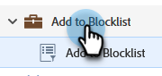
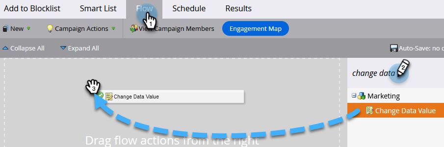

# Person zu Blockierungsliste hinzufügen {#add-person-to-blocklist}

Wenn Sie Personen zu Ihrer Blockierungsliste hinzufügen, wird verhindert, dass sie Ihre Korrespondenz erhalten.

1. Erstellen Sie ein neues [Standardprogramm](/help/marketo/product-docs/core-marketo-concepts/programs/creating-programs/create-a-program.md){target="_blank"} und nennen Sie es &quot;Zu Blockierungsliste hinzufügen&quot;.

1. Klicken Sie auf **[!UICONTROL Neu]** und wählen Sie **[!UICONTROL Neues lokales Asset]** aus.

   

1. Wählen Sie **[!UICONTROL Smart List]** aus.

   

1. Benennen Sie Ihre Liste und klicken Sie auf **[!UICONTROL Erstellen]**.

   

1. Fügen Sie alle Personen zu Ihrer Smart-Liste hinzu, die Sie Ihrer Blockierungsliste hinzufügen möchten.

   

   >[!NOTE]
   >
   >Personen auf Ihrer Blockierungsliste erhalten keine operativen E-Mails.

1. Gehen Sie zurück zu Ihrem Programm.

   

1. Klicken Sie auf **[!UICONTROL Neu]** und wählen Sie **[!UICONTROL Neue Smart-Kampagne]** aus.

   

1. Benennen Sie die neue Smart-Kampagne. Klicken Sie auf **[!UICONTROL Erstellen]**.

   

1. Ziehen Sie **[!UICONTROL Mitglied der Smart-Liste]** in den Arbeitsbereich.

   

1. Wählen Sie die soeben erstellte Smart-Liste aus.

   

1. Klicken Sie auf die Registerkarte **[!UICONTROL Fluss]**. Ziehen Sie die Flussaktion **[!UICONTROL Datenwert ändern]** in den Arbeitsbereich.

   

1. Wählen Sie in der Dropdown-Liste **[!UICONTROL Attribut]** die Option **[!UICONTROL Block Listed]** und setzen Sie **[!UICONTROL New Value]** auf **[!UICONTROL true]**.

   

1. Klicken Sie auf die Registerkarte **[!UICONTROL Plan]** und wählen Sie **[!UICONTROL Einmal ausführen]** aus.

   

1. Wählen Sie **[!UICONTROL Jetzt ausführen]** und klicken Sie auf **[!UICONTROL Ausführen]**.

   

1. Klicken Sie erneut auf **[!UICONTROL Ausführen]** .

   

Diese Personen erhalten keine E-Mails mehr.

>[!TIP]
>
>Erstellen Sie eine [Trigger-Kampagne](/help/marketo/product-docs/core-marketo-concepts/smart-campaigns/creating-a-smart-campaign/create-a-new-smart-campaign.md){target="_blank"} mit **Datenwert ändern** und dem Wert **-Auflistung ist wahr** für alle zukünftigen Personen, die über Blockierungsliste-fähige Attribute verfügen.
