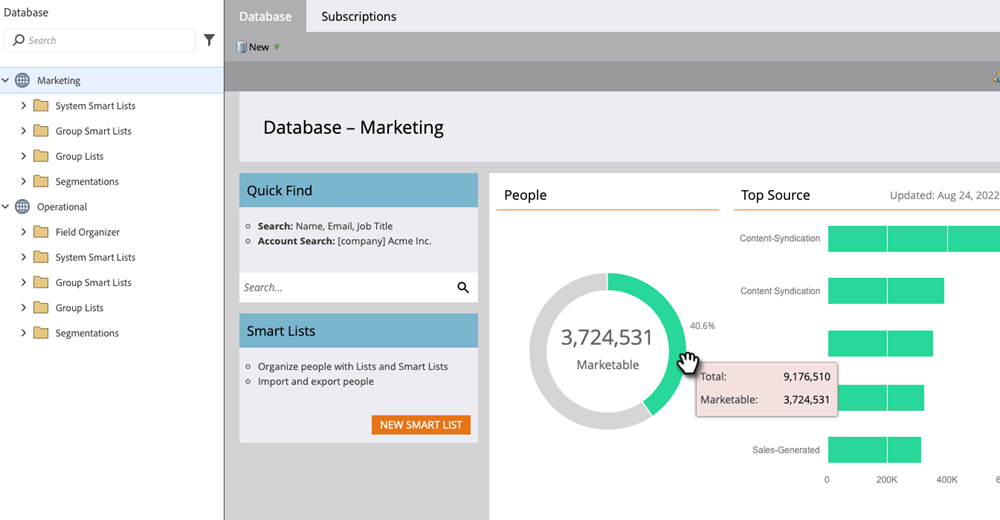

# Datenbank-Dashboard {#database-dashboard}

Das Datenbank-Dashboard dient als Momentaufnahme, mit der Sie wichtige Attribute über Ihre Mitarbeiter in einem Arbeitsbereich schnell ermitteln können.

>[!NOTE]
>
>* Das Datenbank-Dashboard wird automatisch alle 24-32 Stunden aktualisiert. Sie können jederzeit eine manuelle Aktualisierung durchführen, indem Sie auf den Text „Letzte Aktualisierung“ auf der rechten Seite des Bildschirms klicken.
>
>* Jeder Arbeitsbereich verfügt über ein eigenes Datenbank-Dashboard.

Um dorthin zu gelangen, wählen Sie **[!UICONTROL Datenbank]** aus „Mein Marketo&quot; aus.

Die Diagramme zeigen die Gesamtzahl der Personen, die Anzahl der vermarktbaren Personen sowie Ihre fünf wichtigsten Erwerbsquellen an. Bewegen Sie den Mauszeiger über grüne Bereiche, um weitere Details anzuzeigen.

>[!TIP]
>
>Möchten Sie genauere oder zeitnahere Informationen über Ihre Mitarbeiter erhalten? Probieren Sie einen [Leistungsbericht für Personen](/help/marketo/product-docs/reporting/basic-reporting/report-types/people-performance-report.md){target="_blank"} aus.

**Personen insgesamt:** Die Anzahl der Personen, die alle Zeit für den aufgelisteten Arbeitsbereich beschäftigt sind.

auf die Blockierungsliste setzen **Marketingfähige Personen:** Die Anzahl der Personen, die alle Zeit für den aufgelisteten Arbeitsbereich beschäftigt sind, _abzüglich der folgenden_: Personen ohne E-Mail-Adresse, Personen, deren E-Mail einen Hardbounce verursacht hat, Personen, die sich abgemeldet haben, Personen, die sich abgemeldet haben, Personen, die derzeit auf „Marketing ausgesetzt“ gesetzt sind.
