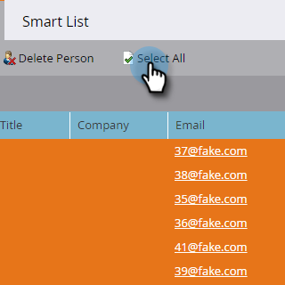

# Löschen von Personen in einer Smart List oder Liste {#delete-people-in-a-smart-list-or-list}

Sie können einige oder alle Personen löschen, die sich in einer Liste oder einer Smart-Liste befinden.

>[!PREREQUISITES]
>
>[Erstellen einer Smart-Liste](/help/marketo/product-docs/core-marketo-concepts/smart-lists-and-static-lists/creating-a-smart-list/create-a-smart-list.md)

1. Navigieren Sie zu **[!UICONTROL Marketing-Aktivitäten]**.

   

1. Wählen Sie die Liste/Smart-Liste aus, die alle Personen enthält, die Sie löschen möchten, und gehen Sie zur Registerkarte **[!UICONTROL Personen]** .

   

   >[!CAUTION]
   >
   >Wenn Sie eine Person löschen, entfernen Sie sie nicht nur aus der Liste, sondern vollständig aus der Datenbank.

1. Klicken Sie **[!UICONTROL Alle auswählen]**. Sie können auch einige Datensätze mit der Hand auswählen, indem Sie Strg/Befehl drücken und klicken.

   

   >[!NOTE]
   >
   >Wenn sich die Ergebnisse über mehrere Seiten erstrecken, werden durch Klicken auf **[!UICONTROL Alle auswählen]** alle Personen auf allen Seiten ausgewählt.

1. Um die Personen vollständig aus Marketo zu entfernen, klicken Sie auf **[!UICONTROL Person löschen]**.

   

1. Legen Sie **[!UICONTROL Aus CRM entfernen]** auf **[!UICONTROL true]** fest, wenn Sie die Datensätze auch aus Ihrem CRM löschen möchten.

   

   >[!CAUTION]
   >
   >Das Löschen aus Marketo und Ihrem CRM bedeutet, dass Sie in keinem der Systeme eine Wiederherstellung durchführen können. Die Menschen und ihre Geschichte werden für immer verschwunden sein. Wenn Sie sie später wieder hinzufügen, werden sie als brandneue Datensätze behandelt.

   >[!NOTE]
   >
   >Wenn Ihr Marketo nicht an Ihr CRM gebunden ist, ist die Option wie im Screenshot ausgegraut.

1. Klicken Sie **[!UICONTROL Jetzt ausführen]**.

   

1. Wenn Sie mehr als 50 Personen löschen, sehen Sie dies. Geben Sie die Anzahl der zu löschenden Personen ein, aktivieren Sie das Kontrollkästchen **[!UICONTROL Nicht rückgängig machen]** und klicken Sie dann auf **[!UICONTROL Löschen]**.

   

   >[!NOTE]
   >
   >Um die Ergebnisse der Massenlöschung anzuzeigen, klicken Sie **[!UICONTROL Ergebnisse anzeigen]** in der rechten oberen Ecke des Bildschirms im Popup-Feld Einzelflussaktion . Die Löschzeiten können je nach mehreren Faktoren stark variieren.

   Verwenden Sie diese Funktion mit Vorsicht.
