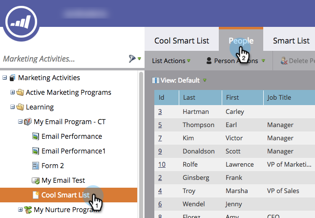

# Exportieren von Personen aus einer Liste oder einer intelligenten Liste nach Excel {#export-people-to-excel-from-a-list-or-smart-list}

Wenn Sie Listen- oder Smart-Listen-Ergebnisse außerhalb von Marketo benötigen, können Sie diese einfach in Excel exportieren. Und so geht das.

1. Navigieren Sie **[!UICONTROL Marketing-Aktivitäten]**.

   

1. Wählen Sie die zu exportierende Liste oder Smart-Liste aus und wechseln Sie zur Registerkarte **[!UICONTROL Personen]**.

   

1. Klicken Sie unten auf der Seite auf das Excel-Symbol.

   

1. Wählen Sie **[!UICONTROL Sichtbare Spalten]** und klicken Sie auf **[!UICONTROL Exportieren]**.

   

   >[!NOTE]
   >
   >Wenn Sie **[!UICONTROL Alle Spalten]** auswählen, wird der Export größer und die Generierung/der Download dauert länger.

   >[!TIP]
   >
   >Wenn Ihre Personendatensätze Fremdzeichen enthalten, die beim Export nicht richtig gerendert werden, versuchen Sie, den Dateityp in der Dropdown-Liste **[!UICONTROL Format]** zu ändern.

1. Der Export wird ausgeführt. Wenn Sie fertig sind, können Sie auf **[!UICONTROL Jetzt herunterladen]** klicken, um die Datei zu erfassen.

   

   >[!TIP]
   >
   >Wenn der Export eine Weile dauert, können Sie sich jederzeit abmelden und später erneut darauf zugreifen. Der Link **[!UICONTROL Jetzt herunterladen]** kann durch Auswahl von **[!UICONTROL Exportstatus anzeigen]** im Menü **[!UICONTROL Aktionen auflisten]** aufgerufen werden und ist eine Woche lang gültig.
