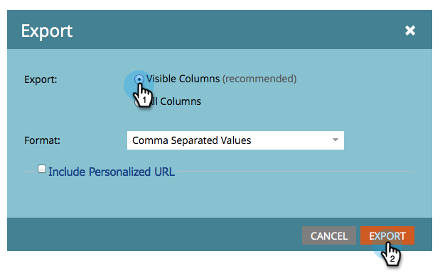

# Export von Personen in Excel aus einer Liste oder einer Smart-Liste {#export-people-to-excel-from-a-list-or-smart-list}

Wenn Sie Listen oder Ergebnisse intelligenter Listen außerhalb von Marketo benötigen, können Sie einfach nach Excel exportieren. So geht es.

>[!NOTE]
>
>**FYI**
>
>Marketo standardisiert nun die Sprache für alle Abonnements, sodass Sie möglicherweise Interessenten in Ihrem Abonnement und Personen/Personen in docs.marketo.com sehen können. Diese Begriffe bedeuten dasselbe. Es hat keine Auswirkungen auf die Artikelanweisungen. Es gibt auch noch einige andere Änderungen. [Weitere Informationen](http://docs.marketo.com/display/DOCS/Updates+to+Marketo+Terminology).

1. Gehen Sie zu **Marketing-Aktivitäten**.

   

1. Wählen Sie die zu exportierende Liste oder intelligente Liste aus und gehen Sie zur Registerkarte &quot; **Personen** &quot;.

   

1. Klicken Sie unten auf der Seite auf das Excel-Symbol.

   

1. Wählen Sie **Sichtbare Spalten** und klicken Sie auf **Exportieren**.

   

   >[!NOTE]
   >
   >Wenn Sie &quot; **Alle Spalten**&quot;auswählen, ist der Export größer und dauert länger, bis er generiert bzw. heruntergeladen wird.

   >[!TIP]
   >
   >Wenn Ihre persönlichen Datensätze Fremdzeichen enthalten, die beim Exportieren nicht richtig dargestellt werden, versuchen Sie, den Dateityp in der Dropdown-Liste &quot; **Format** &quot;zu ändern.

1. Der Export wird ausgeführt. Nach Abschluss können Sie auf Jetzt **herunterladen klicken** , um die Datei zu erfassen.

   

   >[!TIP]
   >
   >Wenn der Export eine Weile in Anspruch nimmt, können Sie sich jederzeit abmelden und später darauf zurückkommen. Auf den Link **Jetzt** herunterladen können Sie zugreifen, indem Sie im Menü &quot;Aktionen **der** Liste&quot;die Option &quot;Exportstatus **** anzeigen&quot;auswählen. Er ist eine Woche gültig.

   Nachdem Sie eine intelligente Liste nach Excel exportiert haben, wird die Liste automatisch im Cache gespeichert. Wenn Sie sich das nächste Mal anmelden oder Ihren Browser aktualisieren, werden Sie eine kleine Papierklammer und eine Klebezettel auf dem Symbol für die intelligente Liste sehen.

   

   >[!TIP]
   >
   >Sie können die Zwischenspeicherung der Liste rückgängig machen, indem Sie einfach auf die Aktualisierungsschaltfläche der Liste klicken.

