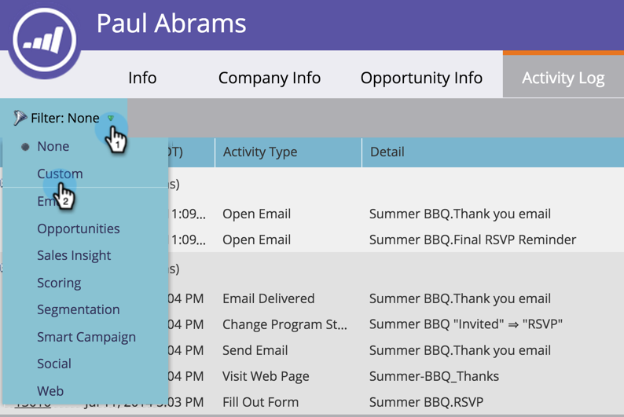

# Filtern nach Aktivitätstypen im Aktivitätsprotokoll einer Person {#filter-activity-types-in-the-activity-log-of-a-person}

Suchen Sie im Aktivitätsprotokoll nach den Aktivitäten, die Ihnen am wichtigsten sind.

>[!NOTE]
>
>Weitere Informationen über [das Aktivitätsprotokoll](/help/marketo/product-docs/core-marketo-concepts/smart-lists-and-static-lists/managing-people-in-smart-lists/locate-the-activity-log-for-a-person.md){target="_blank"}.

1. Navigieren Sie zur Seite „Personendetails“. Klicken Sie auf **[!UICONTROL Registerkarte]** Aktivitätsprotokoll“.

   

1. Wählen Sie die **[!UICONTROL Filter]** aus.

   

## Erstellen benutzerdefinierter Filter {#creating-custom-filters}

1. Klicken Sie auf **[!UICONTROL Dropdown]** Filter“. Wählen Sie **[!UICONTROL Benutzerdefiniert]** aus.

   

1. Wählen Sie die Aktivitäten aus, nach denen gefiltert werden soll. Klicken Sie **[!UICONTROL Speichern unter]**.

   

1. Geben Sie einen **[!UICONTROL benutzerdefinierten Filternamen]** ein. Klicken Sie auf **[!UICONTROL Speichern]**.

   

   Jetzt werden nur noch Personenaktivitäten angezeigt, die den Kriterien des Filters entsprechen.

   

## Referenzieren gespeicherter Filter {#reference-saved-filters}

Auf gespeicherte Filter kann über die Dropdown-Liste [!UICONTROL Filter] zugegriffen werden.

1. Klicken Sie auf **[!UICONTROL Dropdown-]** „Filter“. Wählen Sie **[!UICONTROL Benutzerdefiniert]** aus.

   

1. Klicken Sie **[!UICONTROL Gespeicherte Filter]**. Gespeicherte Filter sind unten aufgeführt.

   
