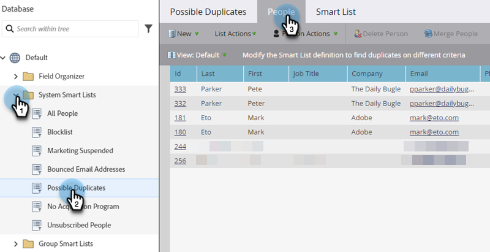

# Suchen und Zusammenführen doppelter Personen {#find-and-merge-duplicate-people}

Marketo Engage dedupliziert automatisch, wenn neue Personen in das System eintreten. Möglicherweise hat Ihr CRM jedoch zunächst Duplikate gesendet. So führen wir sie zusammen.

>[!CAUTION]
>
>Personen zusammenzuführen ist dauerhaft, es gibt keine „Rückgängig“-Option.

>[!PREREQUISITES]
>
>Das Suchen und Zusammenführen von Duplikaten erfolgt mithilfe von [integrierten/Smart-Listen des Systems](/help/marketo/product-docs/core-marketo-concepts/smart-lists-and-static-lists/using-smart-lists/use-built-in-system-smart-lists.md){target="_blank"}.

>[!NOTE]
>
>Marketo wird nicht automatisch dedupliziert, wenn ein [!DNL Salesforce] oder eine [!DNL Microsoft Dynamics] Synchronisierung durchgeführt wird oder Sie Personen manuell eingeben.

## Duplikate suchen {#find-duplicates}

1. Wechseln Sie dazu zum Bereich **[!UICONTROL Datenbank]**.

   

   >[!CAUTION]
   >
   >Das Zusammenführen von Personen in Marketo funktioniert möglicherweise nicht, wenn Sie ein [!DNL Salesforce] Personen -Konto verwenden. Bitte die Einträge nach Möglichkeit in [!DNL Salesforce] zusammenführen.

1. Wählen Sie die **[!UICONTROL Mögliche Duplikate]** System Smart List aus und klicken Sie auf die Registerkarte **[!UICONTROL People]**.

   

   >[!NOTE]
   >
   >Sie können auch [Duplikate mit benutzerdefinierter Logik suchen](/help/marketo/product-docs/core-marketo-concepts/smart-lists-and-static-lists/managing-people-in-smart-lists/find-duplicate-people-with-custom-logic.md){target="_blank"}.

## Personen manuell zusammenführen {#merge-people-manually}

>[!CAUTION]
>
>Wenn Personen zusammengeführt werden und die unterliegende Person über ein benutzerdefiniertes Marketo-Objekt verfügt, wird _nicht_ wieder mit der erfolgreichsten Person verknüpft. Übernehmen Sie das benutzerdefinierte Objekt vor dem Ausführen der Zusammenführung erneut.

1. Wählen Sie die Duplikate aus, indem Sie die Strg-/Befehlstaste gedrückt halten und dann auf „Personen **[!UICONTROL &quot;]**.

   

   >[!TIP]
   >
   >Möglicherweise gibt es zwei oder mehr Duplikate für dieselbe Person. Wählen Sie sie alle gleichzeitig aus.

1. Zwischen den Datensätzen werden die Werte angezeigt, _nicht_. Wählen Sie den Wert aus, den Sie für jedes Feld beibehalten möchten. Klicken Sie abschließend **[!UICONTROL Zusammenführen]**. Wenn Sie keinen der Werte möchten, können Sie **[!UICONTROL Benutzerdefiniert]** aktivieren und einen Wert Ihrer Wahl eingeben.

   

   >[!NOTE]
   >
   >Beim manuellen Zusammenführen von Personen ist die erste ausgewählte Person der „Gewinner“. Wenn Sie also auf der Registerkarte Personen die Datensatz-IDs 198 und 199 zusammenführen und zuerst 199 anklicken, ist 199 die Datensatz-ID der zusammengeführten Personen. Dies gilt auch, wenn mehr als zwei Datensätze zusammengeführt werden.

   >[!TIP]
   >
   >Zusammenführen ist besser als Löschen. Sie speichern den gesamten Verlauf (Seitenbesuche, Link-Klicks, E-Mail-Öffnungen, Formularausfüllungen usw.).

## Auswirkungen in Salesforce {#effect-in-salesforce}

Wenn Sie über eine Salesforce-Integration verfügen, gibt es einige Hinweise über die Auswirkungen des Zusammenführens von Leads in Salesforce.

* Wenn Leads oder nur Kontakte zusammengeführt werden, werden sie gemäß den normalen [!DNL Salesforce] zusammengeführt.
* Beim Zusammenführen von Leads und Kontakten werden alle Leads vor dem Zusammenführen gemäß den normalen [!DNL Salesforce] in Kontakte konvertiert.

Details zum Verhalten von Salesforce beim Zusammenführen von Leads oder Kontakten finden Sie in den folgenden [!DNL Salesforce] Dokumenten:

* [Zusammenführen doppelter Leads](https://help.salesforce.com/HTViewHelpDoc?id=leads_merge.htm&language=en_US){target="_blank"}
* [Doppelte Kontakte werden zusammengeführt](https://help.salesforce.com/HTViewHelpDoc?id=contacts_merge.htm&language=en_US){target="_blank"}

## Massenzusammenführung {#bulk-merging}

Wenn Sie zu viele Duplikate zum manuellen Zusammenführen haben, wenden Sie sich an das Adobe Account Team (Ihren Account Manager), um Ihre Optionen zu besprechen.
