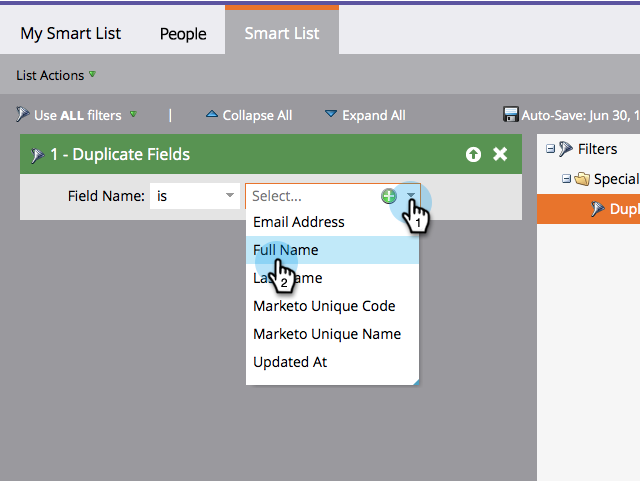

# Suchen nach doppelten Personen mit benutzerdefinierter Logik {#find-duplicate-people-with-custom-logic}

Marketo Engage verfügt über eine System-Smart-List, mit der doppelte Personen anhand ihrer E-Mail-Adressen gefunden werden. Wenn Sie Duplikate mit einem anderen Feld suchen möchten, führen Sie die folgenden Schritte aus.

>[!PREREQUISITES]
>
>[Erstellen einer Smart-Liste](/help/marketo/product-docs/core-marketo-concepts/smart-lists-and-static-lists/creating-a-smart-list/create-a-smart-list.md){target="_blank"}

1. Navigieren Sie zum Bereich **[!UICONTROL Marketing-Aktivitäten]**.

1. Wählen Sie Ihre Smart-Liste aus und klicken Sie auf die Registerkarte **[!UICONTROL Smart-Liste]**.

   

1. Suchen Sie den Filter **[!UICONTROL Felder duplizieren]** und ziehen Sie ihn auf die Arbeitsfläche.

   

1. Wählen Sie eine von vier verfügbaren Optionen:

   * [!UICONTROL E-Mail-]
   * [!UICONTROL Vollständiger Name]
   * [!UICONTROL Nachname]
   * [!UICONTROL Aktualisiert um]

   >[!NOTE]
   >
   >Bei allen Feldern mit Ausnahme der E-Mail-Adresse wird zwischen Groß- und Kleinschreibung unterschieden. Wenn Sie also „Martin Müller“ im Feld Vollständiger Name verwenden _werden_ Ergebnisse für Martin Müller zurückgegeben.

   

   Führen Sie die Smart-Liste aus, um Personen mit demselben Wert im zuvor ausgewählten Feld zu finden.
