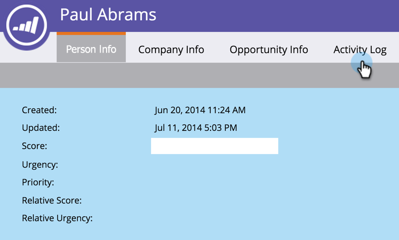
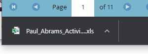

# Suchen des Aktivitätsprotokolls für eine Person {#locate-the-activity-log-for-a-person}

Das Aktivitätsprotokoll ist die ultimative Datenquelle. Dies ist die komplette Geschichte des Journey einer Person in Marketo Engage.

1. Navigieren Sie zur **[!UICONTROL Datenbank]**.

   

1. Wählen Sie **[!UICONTROL Alle Personen]** aus.

   

1. Klicken Sie auf die **[!UICONTROL Personen]**. Wählen Sie eine Personen **[!UICONTROL ID]** Nummer aus.

   

1. Klicken Sie **[!UICONTROL Aktivitätsprotokoll]**.

   

   Sie verfügen nun über eine Sammlung aller Informationen, die im Laufe der Zeit für eine Person auftreten.

   

## Aktivitätsprotokoll exportieren {#export-activity-log}

Möchten Sie das Aktivitätsprotokoll einer Person nach Excel exportieren?

1. Scrollen Sie nach den obigen Schritten zum unteren Rand der Seite und wählen Sie das Symbol Exportieren aus.

   

1. Eine Excel-Datei wird in Ihren Browser heruntergeladen.

   

   >[!MORELIKETHIS]
   >
   >Erfahren Sie mehr über [Filtern des Aktivitätsprotokolls](/help/marketo/product-docs/core-marketo-concepts/smart-lists-and-static-lists/managing-people-in-smart-lists/filter-activity-types-in-the-activity-log-of-a-person.md){target="_blank"} um bestimmte Personenaktivitäten anzuzeigen.
