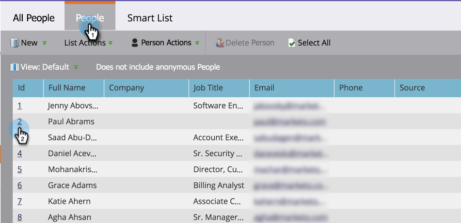

# Suchen Sie das Aktivitätsprotokoll für eine Person {#locate-the-activity-log-for-a-person}

Das Aktivitätsprotokoll ist die ultimative Quelle der Wahrheit. Das ist die komplette Geschichte des Journey einer Person in Marketo.

1. Gehen Sie zur **Datenbank**.

   

1. Wählen Sie **Alle Personen** aus.

   

1. Klicken Sie auf die Registerkarte **Personen** . Wählen Sie eine Person **Id** aus.

   

1. Klicken Sie auf **Aktivitätsprotokoll**.

   

   Sie verfügen nun über eine Sammlung aller Informationen, die im Laufe der Zeit für eine Person auftreten.

   

## Aktivitätsprotokoll exportieren {#export-activity-log}

Sie müssen das Aktivitätsprotokoll einer Person in Excel exportieren?

1. Scrollen Sie nach den obigen Schritten zum unteren Seitenrand und wählen Sie das Symbol Exportieren aus.

   

1. Eine Excel-Datei wird in Ihren Browser heruntergeladen.

   

   >[!MORELIKETHIS]
   >
   >Erfahren Sie mehr über [Filtern des Aktivitätsprotokolls](/help/marketo/product-docs/core-marketo-concepts/smart-lists-and-static-lists/managing-people-in-smart-lists/filter-activity-types-in-the-activity-log-of-a-person.md), um bestimmte Personaktivitäten anzuzeigen.
