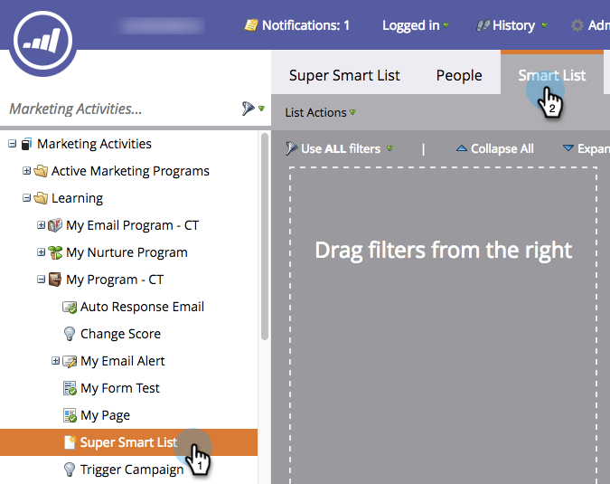

# Verwenden von Listenmitgliedern in einer intelligenten Liste {#use-members-of-list-in-a-smart-list}

>[!TIP]
>
>Sie können Personen mit dem Schritt [Importieren](/help/marketo/getting-started/quick-wins/import-a-list-of-people.md) oder dem Schritt [Zu Liste hinzufügen](/help/marketo/product-docs/core-marketo-concepts/smart-campaigns/flow-actions/add-to-list.md){target="_blank"} zu einer Liste hinzufügen.

Mit diesem Filter können Sie Mitglieder aus einer anderen Liste abrufen, indem Sie in Ihren Regeln für Smart-Listen darauf verweisen.

1. Wählen Sie eine Smart-Liste aus und klicken Sie auf **[!UICONTROL Registerkarte]** Smart-Liste“.

   

1. Suchen Sie im rechten Bedienfeld Filter nach dem Filter **[!UICONTROL Mitglied der Liste]** und ziehen Sie ihn auf die Arbeitsfläche.

   

1. Klicken Sie auf die Dropdown-Liste oder geben Sie ein, um nach der Liste zu suchen, die Sie in Ihre Smart-Liste aufnehmen möchten.

   

   In diesem Beispiel werden für die Smart-Liste nur die Mitglieder dieser Liste ausgewählt und anhand anderer eingeschlossener Regeln ausgewertet.
