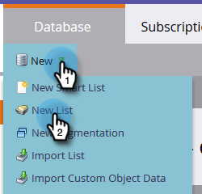
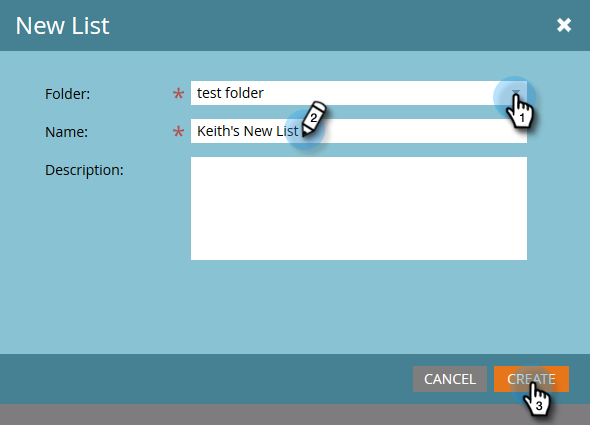

# Erstellen einer statischen Liste {#create-a-static-list}

Statische Listen sind eine Gruppe von Personen, die sich bereits in Ihrer Datenbank befinden. Hier ist, wie man eine erstellt.

1. Navigieren Sie zu **[!UICONTROL Datenbank]**.

   

1. Klicken Sie auf **[!UICONTROL Neu]** und wählen Sie **[!UICONTROL Neue Liste]**.

   

1. Wählen Sie einen Zielordner aus, geben Sie der neuen Liste einen Namen und klicken Sie dann auf **[!UICONTROL Erstellen]**.

   

   Sie können jetzt eine leere Liste ausfüllen lassen. Erfahren Sie, wie Sie Personen hinzufügen [here](/help/marketo/product-docs/core-marketo-concepts/smart-lists-and-static-lists/static-lists/understanding-static-lists.md#ways-to-add-remove-people-from-a-list){target="_blank"}.

   >[!NOTE]
   >
   >Sie können eine Person zu Ihrer Liste hinzufügen, so oft Sie möchten, sie wird jedoch nur einmal angezeigt. Personen bleiben in der Liste, bis Sie sie entfernen.
