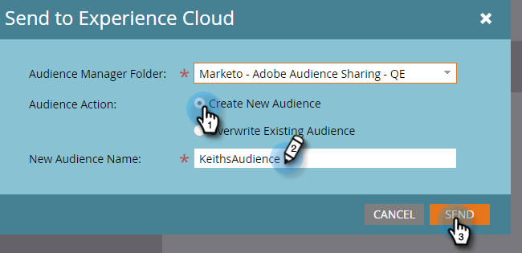

# Statische Liste nach Adobe Experience Cloud exportieren {#export-a-static-list-to-adobe-experience-cloud}

>[!NOTE]
>
>Eine HIPAA-bereite Bereitstellung einer Marketing-Instanz kann diese Funktion nicht verwenden.

>[!PREREQUISITES]
>
>[Einrichten der Freigabe von Adobe Experience Cloud-Audiencen](/help/marketo/product-docs/core-marketo-concepts/miscellaneous/set-up-adobe-experience-cloud-audience-sharing.md)

## Unterstützte Zielanwendungen {#supported-destination-applications}

* Adobe Advertising Cloud
* Adobe Analytics (**nur**, wenn Sie eine Adobe Audience Manager-Lizenz besitzen)
* Adobe Audience Manager
* Adobe Experience Manager
* Adobe Echtzeit-Kundendatenplattform
* Adobe Target

## Exportieren einer Liste {#how-to-export-a-list}

1. Suchen Sie in Marketo die Liste, die Sie exportieren möchten, und wählen Sie sie aus.

   

1. Klicken Sie auf die Dropdown-Liste **Liste Aktionen** und wählen Sie **An Experience Cloud senden**.

   

1. Klicken Sie auf die Dropdownliste **Audience Manager-Ordner** und wählen Sie den gewünschten Zielordner im Experience Cloud aus.

   

1. Wählen Sie, ob Sie eine neue Audience erstellen oder eine vorhandene überschreiben möchten (in diesem Beispiel erstellen wir eine neue). Geben Sie den Namen der neuen Audience ein und klicken Sie auf **Senden**.

   

1. Klicken Sie auf **OK**.

   

   >[!NOTE]
   >
   >Es kann bis zu 6-8 Stunden dauern, bis die Audience in der Adobe voll gefüllt ist.

## Dinge zu beachten {#things-to-note}

**Freigeben für Adobe Analytics**

Für Kunden, die sowohl Adobe Audience Manager als auch Adobe Analytics besitzen, ermöglicht diese Integration die Freigabe von Audiencen von Marketo an Ihre Adobe Analytics Report Suites, es gibt jedoch einige zusätzliche Konfigurationsschritte, die in Adobe Audience Manager durchgeführt werden müssen, um dies zu ermöglichen. Weitere Informationen zum Einrichten dieser Funktion finden Sie in der Adobe Audience Manager-Dokumentation: [https://docs.adobe.com/content/help/en/analytics/integration/audience-analytics/mc-audiences-aam.html](https://docs.adobe.com/content/help/en/analytics/integration/audience-analytics/mc-audiences-aam.html).

**Eigenschaftsverwendung für Adobe Audience Manager-Kunden**

Wenn Sie einen Export von Listen in Marketo starten, werden die folgenden Änderungen in Ihrer Adobe Audience Manager-Instanz angezeigt:

* Für alle Interessenten in der exportierten Liste schreibt Marketo eine Eigenschaft mit den Hash-E-Mails der Interessenten als geräteübergreifende ID. Der Name der Eigenschaft stimmt mit dem Namen der Ziel-Audience überein, den Sie während des Exports angegeben haben.
* Für alle ECIDs, die Marketo mit den Interessenten in der exportierten Liste abgleichen konnte, schreibt Marketo eine Eigenschaft mit der ECID-Gerätekennung. Der Name der Eigenschaft stimmt mit dem Namen der Ziel-Audience überein, den Sie während des Exports angegeben haben.
* Marketo erstellt auch ein Segment in Ihrer Audience Manager-Instanz mit dem ECID-Merkmal als einziges Segmentierungskriterium. Der Segmentname entspricht dem Segmentnamen, den Sie während des Exports angegeben haben.

## FAQ {#faq}

**Warum unterscheidet sich die Liste in Marketo von der in der Adobe?**

Unter der Haube funktioniert die Audience-Integration, indem Marketo Munchkin-Cookies mit dem entsprechenden ECID-Cookie der Adobe synchronisiert werden. Marketo kann nur Mitgliedsdaten für Interessenten freigeben, für die Marketo eine ECID synchronisiert hat. Um optimale Ergebnisse zu erzielen, wird empfohlen, das Verfolgungsskript &quot;munchkin.js&quot;von Marketo parallel zum Trackingcode &quot;Besucher.js&quot;der Adobe auf allen Seiten zu laden, die Sie zu Marketingzwecken verfolgen möchten.

**Wie funktioniert die Cookie-Synchronisierung?**

Wenn die Cookie-Synchronisierung für Ihr Marketo-Abonnement aktiviert ist, versucht die Datei &quot;munchkin.js&quot;von Marketo, ECIDs der Adobe für die Adobe IMS Org zu erfassen und zu speichern, die Sie während der Integrationseinstellung angegeben haben, und diese ECIDs mit der entsprechenden Marketo-Cookie-ID abzustimmen. Dadurch können die anonymen Profil von Marketo mit Adobe-ECIDs bereichert werden.

Ein weiterer Schritt ist erforderlich, um das anonyme Benutzerkonto mit einem Lead-Profil zu verknüpfen, das mit einer E-Mail-Adresse ohne Text identifiziert wird. Wie genau dies funktioniert, wird hier beschrieben: [https://docs.marketo.com/display/public/DOCS/Tracking+Anonymous+Activity+and+People](https://docs.marketo.com/display/public/DOCS/Tracking+Anonymous+Activity+and+People).
