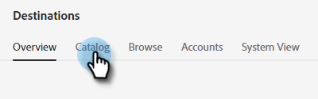
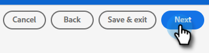

# Adobe Experience Platform-Segment in eine statische Marketo-Liste pushen {#push-an-adobe-experience-platform-segment-to-a-marketo-static-list}

Mit dieser Funktion können Sie Segmente, die sich in Ihrer Adobe Experience Platform befinden, in Form einer statischen Liste an Marketo übergeben.

>[!PREREQUISITES]
>
>* [Erstellen eines API-Benutzers](/help/marketo/product-docs/administration/users-and-roles/create-an-api-only-user.md) in Marketo.
>* Gehen Sie dann zu **Admin** > **Startpunkt**. Suchen Sie den Namen der soeben erstellten Rolle und klicken Sie auf **Details anzeigen**. Kopieren und speichern Sie die Informationen in **Client-ID** und **Client Secret**, da Sie es für diese Funktion benötigen werden.

1. Anmelden bei [Adobe Experience Platform](https://experience.adobe.com/).

   

1. Klicken Sie auf das Rastersymbol und wählen Sie **Experience Platform**.

   

1. Klicken Sie im linken Navigationsbereich auf **Ziele**.

   

1. Klicken **Katalog**.

   

1. Suchen Sie die Kachel Marketo Engage und klicken Sie auf **Segmente aktivieren**.

   

1. Klicken **Neues Ziel konfigurieren**.

1. Klicken Sie unter &quot;Kontotyp&quot;auf das **Neues Konto** Optionsfeld. Geben Sie Ihre Marketo-Anmeldedaten ein und klicken Sie auf **Mit Ziel verbinden**.

   

   >[!NOTE]
   >
   >Sie können Ihre Munchkin-ID finden, indem Sie **Admin** > **Munchkin** (ist auch Teil Ihrer Marketo-URL, nachdem Sie angemeldet sind). Client-ID/Geheimnis , die Sie benötigen, um die Voraussetzungen oben in diesem Artikel zu erfüllen.

1. &quot;Verbunden&quot;sollte unter Ihren Anmeldedaten angezeigt werden. Klicken **Nächste** in der oberen rechten Ecke.

   

1. Geben Sie einen **Name** und _optional_ Beschreibung. Klicken **Ziel erstellen**.

   >[!NOTE]
   >
   >Die Auswahl in Marketing-Aktionen ist ebenfalls optional. Marketo nutzt diese Informationen derzeit nicht, wird aber wahrscheinlich bald nutzen.

   

1. Klicken **Nächste**.

   

1. Wählen Sie das gewünschte Segment aus und klicken Sie auf **Nächste**.

   

   >[!NOTE]
   >
   >Wenn Sie hier mehrere Segmente auswählen, müssen Sie jedes Segment einer angegebenen statischen Liste auf der Registerkarte Segmentplan zuordnen.

1. Klicken **Neue Zuordnung hinzufügen**.

   

1. Klicken Sie auf das Cursorsymbol.

   

1. Wählen Sie entweder **Attribute auswählen** oder **Identitäts-Namespace auswählen** Optionsfeld (in diesem Beispiel wählen wir Attribute aus).

   

   >[!NOTE]
   >
   >Wenn Sie **Identitäts-Namespace auswählen** nach der Auswahl zu Schritt 15 wechseln.

1. Wählen Sie das entsprechende Feld aus, das die E-Mail-Adresse enthält, die den Benutzer identifiziert. Klicken **Auswählen** wann geschehen.

   

   

   >[!NOTE]
   >
   >Das Beispiel, das wir ausgewählt haben, kann sich von Ihrer Auswahl unterscheiden.

1. Klicken Sie auf das Zuordnungssymbol.

   

1. Auswählen **Identitäts-Namespace auswählen**.

   

   >[!IMPORTANT]
   >
   >Die Zuordnung von Attributen ist optional. Zuordnen von E-Mail und/oder ECID aus der **Identitäts-Namespace** -Registerkarte ist die wichtigste Maßnahme, um sicherzustellen, dass die Person in Marketo übereinstimmt. Die Zuordnung von E-Mail stellt die höchste Übereinstimmungsrate sicher.

1. Wählen Sie zwischen ECID oder E-Mail. In diesem Beispiel wählen wir **Email**.

   

1. Klicken **Nächste**.

   

   >[!NOTE]
   >
   >Identitäten werden verwendet, um in Marketo nach Übereinstimmungen zu suchen. Wenn eine Übereinstimmung gefunden wird, wird die Person der statischen Liste hinzugefügt. Wenn keine Übereinstimmung gefunden wird, werden diese Personen abgelegt (d. h. nicht in Marketo erstellt).

1. _In Marketo_, erstellen Sie eine statische Liste oder suchen und wählen Sie eine bereits erstellte Liste aus. Kopieren Sie die Zuordnungs-ID vom Ende der URL.

   

   >[!NOTE]
   >
   >Die besten Ergebnisse erzielen Sie, wenn die Liste, auf die Sie in Marketo verweisen, leer ist.

1. Geben Sie in Adobe Experience Platform die soeben kopierte ID ein. Wählen Sie Ihr Startdatum aus. Die Personen werden bis zum ausgewählten Enddatum kontinuierlich synchronisiert. Lassen Sie das Enddatum für eine unbegrenzte Synchronisierung leer. Klicken **Nächste** wann geschehen.

   

1. Bestätigen Sie Ihre Änderungen und klicken Sie auf **Beenden**.

   
