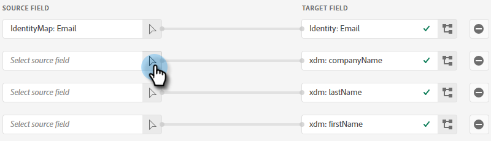

# Pushen eines Adobe Experience Platform-Segments in eine statische Marketo-Liste {#push-an-adobe-experience-platform-segment-to-a-marketo-static-list}

Mit dieser Funktion können Sie Segmente, die sich in Ihrer Adobe Experience Platform befinden, in Form einer statischen Liste an Marketo Engage übertragen.

>[!PREREQUISITES]
>
>* [Bearbeiten Sie die API-Rolle](/help/marketo/product-docs/administration/users-and-roles/create-delete-edit-and-change-a-user-role.md#edit-an-existing-role){target="_blank"} um sicherzustellen, dass sie über die Berechtigung **Person lesen/schreiben** verfügt (finden Sie in der Dropdown-Liste „Zugriff-API„).
>* [Erstellen eines API-](/help/marketo/product-docs/administration/users-and-roles/create-an-api-only-user.md){target="_blank"} in Marketo.
>* Navigieren Sie **[!UICONTROL Admin]** > **[!UICONTROL Launchpoint]**. Suchen Sie den Namen der soeben erstellten Rolle und klicken Sie auf **[!UICONTROL Details]**. Kopieren Sie die Informationen in **[!UICONTROL Client-ID]** und **[!UICONTROL Client-Geheimnis]**, da Sie sie für Schritt 7 benötigen könnten.
>* Erstellen Sie in Marketo eine statische Liste oder suchen und wählen Sie eine bereits erstellte Liste aus. Sie benötigen dessen ID.

1. Anmelden bei [Adobe Experience Platform](https://experience.adobe.com/){target="_blank"}.

   

1. Klicken Sie auf das Rastersymbol und wählen Sie **[!UICONTROL Experience Platform]** aus.

   

1. Klicken Sie in der linken Navigationsleiste auf **[!UICONTROL Ziele]**.

   

1. Klicken Sie **[!UICONTROL Katalog]**.

   

1. Suchen Sie die Kachel Marketo Engage und klicken Sie auf **[!UICONTROL Aktivieren]**.

   

1. Klicken Sie **[!UICONTROL Neues Ziel konfigurieren]**.

   

1. Wählen Sie unter „Kontotyp“ das Optionsfeld „Vorhandenes oder neues Konto“ aus (in diesem Beispiel wählen wir &quot;**[!UICONTROL Konto]**). Klicken Sie auf das Symbol Konto auswählen .

   

   >[!NOTE]
   >
   >Wenn Sie „Neues Konto“ auswählen, können Sie Ihre Munchkin-ID unter **[!UICONTROL Admin]** > **[!UICONTROL Munchkin]** finden (sie ist auch Teil Ihrer Marketo-URL, sobald Sie sich angemeldet haben). Client-ID/Client-Geheimnis, das Sie in den folgenden Voraussetzungen oben in diesem Artikel haben sollten.

1. Wählen Sie das Zielkonto aus und klicken Sie auf **[!UICONTROL Auswählen]**.

   

1. Geben Sie einen **[!UICONTROL (]**) und eine optionale Beschreibung ein. Klicken Sie auf die Dropdown-Liste Personenerstellung und wählen Sie „Vorhandene Marketo-Personen abgleichen und fehlende Personen in Marketo erstellen“ _oder_ „Nur vorhandene Marketo-Personen abgleichen“ (in diesem Beispiel wählen wir erstere). Sie müssen auch eine **[!UICONTROL Workspace auswählen]**.

   

   >[!NOTE]
   >
   >Wenn Sie &quot;[!UICONTROL Nur vorhandene Marketo-Personen abgleichen] auswählen, müssen Sie nur die E-Mail und/oder ECID zuordnen, damit Sie die Schritte 13 bis 16 überspringen können.

1. Dieser Abschnitt ist optional. Klicken Sie **[!UICONTROL Erstellen]**, um zu überspringen.

   

1. Wählen Sie das erstellte Ziel aus und klicken Sie auf **[!UICONTROL Weiter]**.

   

1. Wählen Sie das Segment aus, das Sie an Marketo senden möchten, und klicken Sie auf **[!UICONTROL Weiter]**.

   

   >[!NOTE]
   >
   >Wenn Sie mehrere Segmente auswählen, müssen Sie jedes Segment einer bestimmten statischen Liste auf der Registerkarte [!UICONTROL Segmentplan] zuordnen.

   >[!IMPORTANT]
   >
   >Nachdem ein Segment zum ersten Mal für das Marketo-Ziel aktiviert wurde, kann das Aufstocken von Profilen, die bereits vor der Marketo-Zielaktivierung im Segment vorhanden waren, _bis zu 24 Stunden_. Ab jetzt werden Profile, die dem Segment hinzugefügt werden, sofort zu Marketo hinzugefügt.

1. Klicken Sie **[!UICONTROL Neue Zuordnung hinzufügen]**.

   

1. Klicken Sie auf das Zuordnungssymbol.

   

1. Wählen Sie die gewünschten Attribute aus und klicken Sie auf **[!UICONTROL Auswählen]**. In diesem Beispiel wählen wir Vorname, Nachname und E-Mail-Adresse aus.

   

   >[!NOTE]
   >
   >Sie können Attribute aus Experience Platform jedem der Attribute zuordnen, auf die Ihr Unternehmen in Marketo Engage Zugriff hat. Verwenden Sie die [API-Anfrage beschreiben](https://experienceleague.adobe.com/de/docs/marketo-developer/marketo/rest/lead-database/lead-database#describe){target="_blank"} um Attributfelder abzurufen, auf die Ihre Organisation Zugriff hat.

1. Ordnen Sie den Nachnamen und den Firmennamen zu, indem Sie erneut auf **[!UICONTROL Neue Zuordnung hinzufügen]** klicken und Schritt 15 zweimal wiederholen. Wählen Sie **[!UICONTROL lastName]** und dann **[!UICONTROL companyName]** aus.

   

1. Jetzt ist es an der Zeit, die E-Mail-Adresse zuzuordnen. Klicken **[!UICONTROL erneut auf „Neue Zuordnung]**&quot;.

   

1. Klicken Sie auf das Zuordnungssymbol.

   

1. Klicken Sie auf das Optionsfeld Identity-Namespace auswählen, wählen Sie **[!UICONTROL E-Mail]** aus und klicken Sie dann auf **[!UICONTROL Auswählen]**.

   

   >[!IMPORTANT]
   >
   >Das Zuordnen von E-Mail und/oder ECID auf **[!UICONTROL Registerkarte]** Identity-Namespace“ ist das Wichtigste, um sicherzustellen, dass die Person in Marketo abgeglichen wird. Durch die Zuordnung der E-Mail wird die höchste Übereinstimmungsrate sichergestellt.

1. Jetzt ist es Zeit, die Quellfelder auszuwählen. Für E-Mails klicken Sie auf das Cursor-Symbol.

   

1. Klicken Sie auf das Optionsfeld Identity-Namespace auswählen, suchen Sie nach **[!UICONTROL E-Mail]** und klicken Sie auf **[!UICONTROL Auswählen]**.

   

1. Um das Quellfeld „Firmenname“ auszuwählen, klicken Sie auf das Cursor-Symbol in der Zeile.

   

1. Lassen Sie das Optionsfeld Attribute auswählen aktiviert. Suchen Sie nach „company“ und wählen Sie **[!UICONTROL companyName]** aus und klicken Sie dann auf **[!UICONTROL Select]**.

   

1. Ordnen Sie die Quellfelder für Nachname und Vorname zu, indem Sie jeweils auf das Cursorsymbol klicken und Schritt 23 zweimal wiederholen. Wählen Sie **[!UICONTROL lastName]** und dann **[!UICONTROL firstName]** aus.

   

1. Klicken Sie auf **[!UICONTROL Weiter]**.

   

1. Überprüfen Sie Ihre Änderungen und klicken Sie auf **[!UICONTROL Beenden]**.

   
