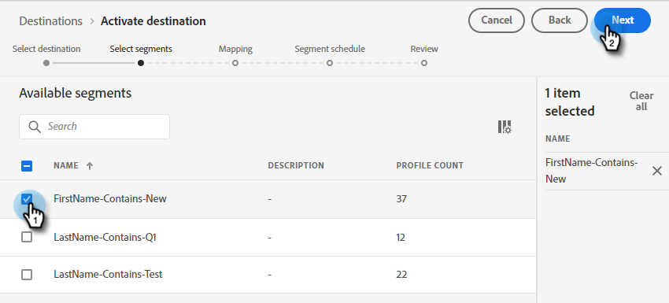

# Adobe Experience Platform-Segment in eine statische Marketo-Liste pushen {#push-an-adobe-experience-platform-segment-to-a-marketo-static-list}

Mit dieser Funktion können Sie Segmente, die sich in Ihrer Adobe Experience Platform befinden, in Form einer statischen Liste an Marketo übergeben.

>[!PREREQUISITES]
>
>* [API-Rolle bearbeiten](/help/marketo/product-docs/administration/users-and-roles/create-delete-edit-and-change-a-user-role.md#edit-an-existing-role) , um sicherzustellen, dass **Lese-/Schreibperson** -Berechtigung (zu finden unter der Dropdown-Liste Access API ).
>* [Erstellen eines API-Benutzers](/help/marketo/product-docs/administration/users-and-roles/create-an-api-only-user.md) in Marketo.
>* Navigieren Sie zu **Admin** > **Startpunkt**. Suchen Sie den Namen der soeben erstellten Rolle und klicken Sie auf **Details anzeigen**. Kopieren und speichern Sie die Informationen in **Client-ID** und **Client Secret**, da Sie es für Schritt 7 benötigen könnten.
>* Erstellen Sie in Marketo eine statische Liste oder suchen und wählen Sie eine bereits erstellte Liste aus. Sie werden ihre Kennung benötigen.

1. Anmelden bei [Adobe Experience Platform](https://experience.adobe.com/).

   

1. Klicken Sie auf das Rastersymbol und wählen Sie **Experience Platform**.

   

1. Klicken Sie im linken Navigationsbereich auf **Ziele**.

   

1. Klicken **Katalog**.

   

1. Suchen Sie die Kachel Marketo Engage und klicken Sie auf **Aktivieren**.

   

1. Klicken **Neues Ziel konfigurieren**.

   

1. Wählen Sie unter Kontotyp die Optionsschaltfläche Vorhandenes oder Neues Konto aus (in diesem Beispiel wählen wir **Vorhandenes Konto**). Klicken Sie auf das Symbol Konto auswählen .

   

   >[!NOTE]
   >
   >Wenn Sie Neues Konto auswählen, können Sie Ihre Munchkin-ID finden, indem Sie **Admin** > **Munchkin** (ist auch Teil Ihrer Marketo-URL, nachdem Sie angemeldet sind). Client-ID/Geheimnis , die Sie benötigen, um die Voraussetzungen oben in diesem Artikel zu erfüllen.

1. Wählen Sie das Zielkonto aus und klicken Sie auf **Auswählen**.

   

1. Ziel eingeben **Name** und eine optionale Beschreibung. Klicken Sie auf das Dropdown-Menü &quot;Personenerstellung&quot;und wählen Sie &quot;Vorhandene Marketo-Personen abgleichen und Fehlende Personen in Marketo erstellen&quot;. _oder_ &quot;Nur vorhandene Marketo-Personen abgleichen&quot;. In diesem Beispiel wählen wir das erste.

   

   >[!NOTE]
   >
   >Wenn Sie &quot;Nur vorhandene Marketo-Personen abgleichen&quot;auswählen, müssen Sie nur die E-Mail und/oder die ECID zuordnen, damit Sie die Schritte 13-16 überspringen können.

1. Dieser Abschnitt ist optional. Klicken **Erstellen** überspringen.

   

1. Wählen Sie das von Ihnen erstellte Ziel aus und klicken Sie auf **Nächste**.

   

1. Wählen Sie das Segment aus, das Sie an Marketo senden möchten, und klicken Sie auf **Nächste**.

   

   >[!NOTE]
   >
   >Wenn Sie mehrere Segmente auswählen, müssen Sie jedes Segment einer angegebenen statischen Liste auf der Registerkarte Segmentplan zuordnen.

   >[!IMPORTANT]
   >
   >Nachdem ein Segment zum ersten Mal für das Marketo-Ziel aktiviert wurde, kann das Aufstocken von Profilen, die bereits vor der Marketo-Zielaktivierung im Segment vorhanden waren, **bis zu 24 Stunden**. Künftig werden jedes Mal, wenn Profile zum Segment hinzugefügt werden, sie sofort zu Marketo hinzugefügt.

1. Klicken **Neue Zuordnung hinzufügen**.

   

1. Klicken Sie auf das Zuordnungssymbol.

   

1. Vornamen zuordnen durch Auswahl von **firstName** und klicken **Auswählen**.

   

1. Ordnen Sie Nachname und Firmenname zu, indem Sie auf **Neue Zuordnung hinzufügen** Wiederholen und Wiederholen von Schritt 15 zweimal, wählen Sie **lastName** und dann **companyName**.

   

1. Jetzt ist es Zeit, die E-Mail-Adresse zuzuordnen. Klicken **Neue Zuordnung hinzufügen** erneut.

   

1. Klicken Sie auf das Zuordnungssymbol.

   

1. Klicken Sie auf die Optionsschaltfläche Identitäts-Namespace auswählen . Wählen Sie  **Email** Klicken Sie auf **Auswählen**.

   

   >[!IMPORTANT]
   >
   >Zuordnen von E-Mail und/oder ECID aus der **Identitäts-Namespace** -Registerkarte ist die wichtigste Maßnahme, um sicherzustellen, dass die Person in Marketo übereinstimmt. Die Zuordnung von E-Mail stellt die höchste Übereinstimmungsrate sicher.

1. Jetzt ist es an der Zeit, die Quellfelder auszuwählen. Klicken Sie für E-Mails auf das Cursorsymbol.

   

1. Klicken Sie auf die Optionsschaltfläche Identitäts-Namespace auswählen und wählen Sie **Email** Klicken Sie auf **Auswählen**.

   

1. Um das Quellfeld Unternehmensname auszuwählen, klicken Sie auf das Cursorsymbol in der Zeile.

   

1. Lassen Sie die Optionsschaltfläche Attribute auswählen aktiviert. Suchen Sie nach &quot;company&quot;und wählen Sie **companyName** Klicken Sie auf **Auswählen**.

   

1. Ordnen Sie die Quellfelder für Nachname und Vorname zu, indem Sie auf das Cursorsymbol für jeden Cursor klicken und Schritt 23 zweimal wiederholen, indem Sie auswählen **lastName** und dann **firstName**.

   

1. Klicken **Nächste**.

   

1. Sie benötigen jetzt die Kennung Ihrer Liste. Klicken Sie auf die Registerkarte in Ihrem Browser, in der die statische Marketo-Liste geöffnet ist (oder öffnen Sie eine neue Registerkarte und wählen Sie die gewünschte statische Liste aus).

   

   >[!NOTE]
   >
   >Die besten Ergebnisse erzielen Sie, wenn Sie eine leere Marketo Engage-Liste verwenden.

1. Markieren und kopieren Sie die Listen-ID am Ende der URL.

   

1. Fügen Sie die soeben kopierte ID unter &quot;Mapping ID&quot;ein und klicken Sie auf **Nächste**.

   

1. Klicken **Beenden**.

   
