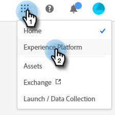
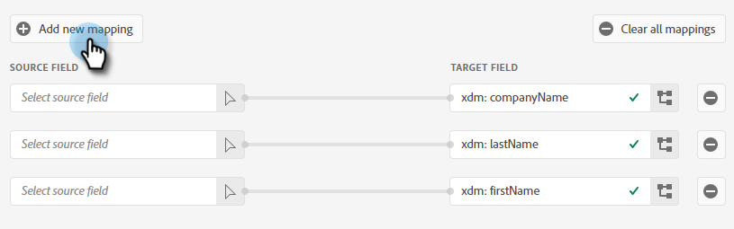

# Push Clone {#push-clone}

Mit dieser Funktion können Sie Segmente, die sich in Ihrer Adobe Experience Platform befinden, in Form einer statischen Liste an Marketo übergeben.

>[!PREREQUISITES]
>
>* [Erstellen eines API-Benutzers](/help/marketo/product-docs/administration/users-and-roles/create-an-api-only-user.md) in Marketo.
>* Gehen Sie dann zu **Admin** > **Startpunkt**. Suchen Sie den Namen der soeben erstellten Rolle und klicken Sie auf **Details anzeigen**. Kopieren und speichern Sie die Informationen in **Client-ID** und **Client Secret**, da Sie es für diese Funktion benötigen werden.

1. Anmelden bei [Adobe Experience Platform](https://experience.adobe.com/).

   

1. Klicken Sie auf das Rastersymbol und wählen Sie **Experience Platform**.

   

1. Klicken Sie im linken Navigationsbereich auf **Ziele**.

   

1. Klicken **Katalog**.

   

1. Suchen Sie die Kachel Marketo Engage und klicken Sie auf **Segmente aktivieren**.

   

1. Klicken **Neues Ziel konfigurieren**.

   

1. Wählen Sie unter Kontotyp die Optionsschaltfläche Vorhandenes oder Neues Konto aus (in diesem Beispiel wählen wir **Vorhandenes Konto**). Klicken Sie auf das Symbol Konto auswählen .

   

1. Wählen Sie das Zielkonto aus und klicken Sie auf **Auswählen**.

   

Als Nächstes müssen Sie auswählen, ob Sie nur bestehende Marketo-Personen zuordnen oder vorhandene Marketo-Personen zuordnen und die vermissten Personen in Marketo erstellen möchten. Im Folgenden finden Sie Abschnitte, in denen die einzelnen Schritte beschrieben werden.

## Vorhandene Marketo-Personen abgleichen und fehlende Personen in Marketo erstellen {#match-existing-marketo-people-create-missing-people}

Nach den Schritten 1-8 von oben ...

1. Ziel eingeben **Name** und eine optionale Beschreibung. Klicken Sie auf das Dropdown-Menü Personenerstellung und wählen Sie **Vorhandene Marketo-Personen abgleichen und fehlende Personen in Marketo erstellen**.

   

1. Dieser Abschnitt ist optional. Klicken **Erstellen** überspringen.

   

1. Wählen Sie das von Ihnen erstellte Ziel aus und klicken Sie auf **Nächste**.

   

1. Wählen Sie das Segment aus, das Sie an Marketo senden möchten, und klicken Sie auf **Nächste**.

   

1. Klicken **Neue Zuordnung hinzufügen**.

   

1. Klicken Sie auf das Zuordnungssymbol.

   

1. Vornamen zuordnen durch Auswahl von **firstName** und klicken **Auswählen**.

   

1. Ordnen Sie Nachname und Firmenname zu, indem Sie auf **Neue Zuordnung hinzufügen** Wiederholen Sie erneut Schritt 7 zweimal und wählen Sie lastName und dann companyName aus.

   

1. Jetzt ist es Zeit, die E-Mail-Adresse zuzuordnen. Klicken **Neue Zuordnung hinzufügen** erneut.

   

1. Klicken Sie auf das Zuordnungssymbol.

   

1. Klicken Sie auf die Optionsschaltfläche Identitäts-Namespace auswählen . Wählen Sie  **Email** Klicken Sie auf **Auswählen**.

   

1. Jetzt ist es an der Zeit, die Quellfelder auszuwählen. Klicken Sie für E-Mails auf das Cursorsymbol.

   

1. Klicken Sie auf die Optionsschaltfläche Identitäts-Namespace auswählen und wählen Sie **Email** Klicken Sie auf **Auswählen**.

   

MORREEEE

## Nur vorhandene Marketo People abgleichen {#match-existing-marketo-people-only}

>[!NOTE]
>
>Identitäten werden verwendet, um in Marketo nach Übereinstimmungen zu suchen. Wenn eine Übereinstimmung gefunden wird, wird die Person der statischen Liste hinzugefügt. Wenn keine Übereinstimmung gefunden wird, werden diese Personen abgelegt (d. h. nicht in Marketo erstellt).

1. _In Marketo_, erstellen Sie eine statische Liste oder suchen und wählen Sie eine bereits erstellte Liste aus. Kopieren Sie die Zuordnungs-ID vom Ende der URL.

PICC

>[!NOTE]
>
>Die besten Ergebnisse erzielen Sie, wenn die Liste, auf die Sie in Marketo verweisen, leer ist.

1. Geben Sie in Adobe Experience Platform die soeben kopierte ID ein. Wählen Sie Ihr Startdatum aus. Die Personen werden bis zum ausgewählten Enddatum kontinuierlich synchronisiert. Lassen Sie das Enddatum für eine unbegrenzte Synchronisierung leer. Klicken **Nächste** wann geschehen.

PICC

1. Bestätigen Sie Ihre Änderungen und klicken Sie auf **Beenden**.

PICC
