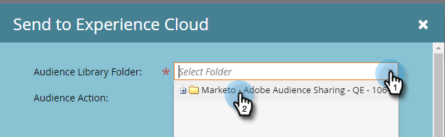

# Senden einer Liste an Adobe Experience Cloud {#send-a-list-to-adobe-experience-cloud}

>[!NOTE]
>
>Eine HIPAA-bereite Bereitstellung einer Marketo Engage-Instanz kann diese Funktion nicht verwenden.

>[!PREREQUISITES]
>
>[Einrichten der Adobe-Organisationszuordnung](/help/marketo/product-docs/adobe-experience-cloud-integrations/set-up-adobe-organization-mapping.md){target="_blank"}

## Unterstützte Zielanwendungen {#supported-destination-applications}

* Adobe Advertising Cloud
* ADOBE ANALYTICS (_only_ wenn Sie eine Adobe Audience Manager-Lizenz besitzen)
* Adobe Audience Manager
* Adobe Experience Manager
* Adobe Real-time Customer Data Platform
* Adobe Target

## Senden einer statischen Liste {#how-to-send-a-static-list}

Eine statische Liste ist genau das, statisch. Die Liste in Adobe Experience Cloud wird nur geändert, wenn Sie sie manuell vornehmen.

1. Suchen Sie in Marketo die Liste, die Sie exportieren möchten. Klicken Sie mit der rechten Maustaste darauf und wählen Sie **[!UICONTROL An Experience Cloud senden]**.

   

1. Klicken Sie auf **[!UICONTROL Audience Manager-Ordner]** und wählen Sie den gewünschten Zielordner im Experience Cloud aus.

   

1. Wählen Sie aus, ob Sie eine neue Zielgruppe erstellen oder eine bestehende überschreiben möchten (in diesem Beispiel erstellen wir eine neue). Geben Sie den neuen Zielgruppennamen ein und klicken Sie auf **[!UICONTROL Senden]**.

   

1. Klicks **[!UICONTROL OK]**.

   

   >[!NOTE]
   >
   >Es kann bis zu 6-8 Stunden dauern, bis die Zielgruppenzugehörigkeit vollständig in Adobe aufgefüllt ist.

## Senden einer synchronisierten Liste {#how-to-send-a-synced-list}

Die Synchronisierung einer Liste bedeutet, dass eine Liste in Marketo jedes Mal aktualisiert wird, wenn diese Änderung automatisch mit ihrer Zielgruppe in Adobe Experience Cloud synchronisiert wird.

1. Suchen Sie in Marketo die Liste, die Sie exportieren möchten. Klicken Sie mit der rechten Maustaste darauf und wählen Sie **[!UICONTROL An Experience Cloud senden]**.

   

1. Klicken Sie auf **[!UICONTROL Zielgruppenbibliotheksordner]** und wählen Sie den gewünschten Zielordner im Experience Cloud aus.

   

1. Wählen Sie aus, ob Sie eine neue Zielgruppe erstellen oder eine bestehende überschreiben möchten (in diesem Beispiel erstellen wir eine neue). Geben Sie den neuen Zielgruppennamen ein, überprüfen Sie die **[!UICONTROL Zielgruppenmitgliedschaft synchron halten]** und klicken Sie auf **[!UICONTROL Senden]**.

   

1. Klicks **OK**.

   

## Anhalten der Listensynchronisierung {#how-to-stop-a-list-sync}

Sie können die Synchronisierung Ihrer Liste jederzeit verhindern.

1. Suchen Sie in Marketo die Liste, deren Synchronisierung Sie beenden möchten, und klicken Sie mit der rechten Maustaste darauf. Klicks **[!UICONTROL Listensynchronisierung beenden]**.

   

1. Wählen Sie die Zielgruppen aus, deren Synchronisation Sie beenden möchten, und klicken Sie auf **[!UICONTROL Anhalten]**.

   

1. Klicks **[!UICONTROL Anhalten]** zur Bestätigung.

   

## Zu beachten {#things-to-note}

**Freigeben für Adobe Analytics**

Für Kunden, die sowohl über Adobe Audience Manager als auch Adobe Analytics verfügen, ermöglicht diese Integration die Freigabe von Zielgruppen aus Marketo für Ihre Adobe Analytics Report Suites. Es gibt jedoch einige zusätzliche Konfigurationsschritte, die in Adobe Audience Manager unternommen werden müssen, um dies zu aktivieren. Bitte überprüfen Sie [Dokumentation zu Adobe Audience Manager](https://experienceleague.adobe.com/docs/analytics/integration/audience-analytics/mc-audiences-aam.html){target="_blank"} für weitere Informationen zur Einrichtung.

**Eigenschaftsnutzung für Adobe Audience Manager-Kunden**

Wenn Sie einen Listenexport in Marketo starten, werden die folgenden Änderungen in Ihrer Adobe Audience Manager-Instanz angezeigt:

* Für alle Leads in der exportierten Liste schreibt Marketo eine Eigenschaft mit den Hash-E-Mails der Leads als geräteübergreifende Kennung. Der Name der Eigenschaft stimmt mit dem Zielgruppennamen überein, den Sie beim Export angegeben haben.
* Für alle ECIDs, die Marketo mit den Leads in der exportierten Liste abgeglichen hat, schreibt Marketo eine Eigenschaft mit der ECID-Gerätekennung. Der Name der Eigenschaft stimmt mit dem Zielgruppennamen überein, den Sie beim Export angegeben haben.
* Marketo erstellt außerdem ein Segment in Ihrer Audience Manager-Instanz mit der ECID-Eigenschaft als einziges Segmentierungskriterium. Der Name des Segments stimmt mit dem Zielgruppennamen überein, den Sie beim Export angegeben haben.

## FAQs {#faq}

**Warum unterscheidet sich die Listengröße in Marketo von der in Adobe?**

Im Hintergrund funktioniert die Zielgruppenintegration durch Synchronisation von Marketo Munchkin-Cookies mit dem entsprechenden Adobe ECID-Cookie. Marketo kann nur Mitgliedschaftsdaten für Leads freigeben, für die Marketo eine ECID synchronisiert hat. Um optimale Ergebnisse zu erzielen, wird empfohlen, das Tracking-Skript von Marketo munchkin.js parallel zum Tracking-Code von Adobe visitor.js auf allen Seiten zu laden, die Sie für Marketingzwecke verfolgen möchten.

**Wie funktioniert die Cookie-Synchronisierung?**

Wenn die Cookie-Synchronisierung für Ihr Marketo-Abonnement aktiviert ist, versucht die Marketo-Datei munchkin.js, Adobe-ECIDs für die Adobe IMS-Organisation zu erfassen und zu speichern, die Sie während der Integrationseinrichtung angegeben haben, und diese ECIDs mit der entsprechenden Marketo-Cookie-ID abzugleichen. Dadurch können anonyme Benutzerprofile von Marketo mit Adobe ECIDs angereichert werden.

Ein weiterer Schritt ist erforderlich, um das anonyme Benutzerprofil einem Lead-Profil zuzuordnen, das mithilfe einer Text-E-Mail identifiziert wird. So funktioniert das genau [hier beschrieben](/help/marketo/product-docs/reporting/basic-reporting/report-activity/tracking-anonymous-activity-and-people.md){target="_blank"}.

**Welche Informationen werden weitergegeben?**

Diese Integration teilt nur die Mitgliedschaftsinformationen von Marketo an Adobe (z. B. das Wissen, dass Lead X Mitglied von List Y ist). Über diese Integration werden keine zusätzlichen Lead-Attribute für Adobe freigegeben.
