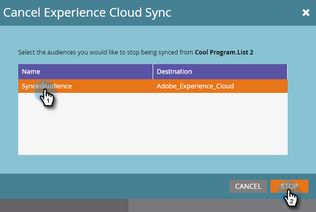

# Liste an Adobe Experience Cloud senden {#send-a-list-to-adobe-experience-cloud}

>[!NOTE]
>
>Eine HIPAA-bereite Bereitstellung einer Marketo-Instanz kann diese Funktion nicht verwenden.

>[!PREREQUISITES]
[Einrichten der Adobe Experience Cloud-Zielgruppenfreigabe](/help/marketo/product-docs/core-marketo-concepts/miscellaneous/set-up-adobe-experience-cloud-audience-sharing.md)>
>

## Unterstützte Zielanwendungen {#supported-destination-applications}

* Adobe Advertising Cloud
* Adobe Analytics (**nur**, wenn Sie eine Adobe Audience Manager-Lizenz besitzen)
* Adobe Audience Manager
* Adobe Experience Manager
* Echtzeit-Kundendatenplattform von Adobe
* Adobe Target

## Senden einer statischen Liste {#how-to-send-a-static-list}

Eine statische Liste ist genau das, statisch. Die Liste in Adobe Experience Cloud wird nur geändert, wenn Sie sie manuell vornehmen.

1. Suchen und wählen Sie in Marketo die Liste aus, die Sie exportieren möchten.

   

1. Klicken Sie auf das Dropdown-Menü **Listenaktionen** und wählen Sie **An Experience Cloud senden** aus.

   

1. Klicken Sie auf die Dropdown-Liste **Audience Manager-Ordner** und wählen Sie den gewünschten Zielordner im Experience Cloud aus.

   

1. Wählen Sie aus, ob Sie eine neue Zielgruppe erstellen oder eine bestehende überschreiben möchten (in diesem Beispiel erstellen wir eine neue). Geben Sie den neuen Zielgruppennamen ein und klicken Sie auf **Senden**.

   

1. Klicken Sie auf **OK**.

   

   >[!NOTE]
   Es kann bis zu 6-8 Stunden dauern, bis die Zielgruppenmitgliedschaft vollständig in Adobe gefüllt ist.

## So senden Sie eine synchronisierte Liste {#how-to-send-a-synced-list}

Die Synchronisierung einer Liste bedeutet, dass eine Liste in Marketo jedes Mal aktualisiert wird, wenn diese Änderung automatisch mit ihrer Zielgruppe in Adobe Experience Cloud synchronisiert wird.

1. Suchen und wählen Sie in Marketo die Liste aus, die Sie synchronisieren möchten.

   

1. Klicken Sie auf das Dropdown-Menü **Listenaktionen** und wählen Sie **An Experience Cloud senden** aus.

   

1. Klicken Sie auf die Dropdown-Liste **Zielgruppenbibliotheksordner** und wählen Sie den gewünschten Zielordner im Experience Cloud aus.

   

1. Wählen Sie aus, ob Sie eine neue Zielgruppe erstellen oder eine bestehende überschreiben möchten (in diesem Beispiel erstellen wir eine neue). Geben Sie den neuen Zielgruppennamen ein, aktivieren Sie das Kontrollkästchen **Zielgruppenmitgliedschaft in Sync** und klicken Sie auf **Senden**.

   

1. Klicken Sie auf **OK**.

   

## Anhalten einer Listensynchronisierung {#how-to-stop-a-list-sync}

Sie können die Synchronisierung Ihrer Liste jederzeit verhindern.

1. Suchen und wählen Sie in Marketo die Liste aus, die die Synchronisierung stoppen soll.

   

1. Klicken Sie auf das Dropdown-Menü **Listenaktionen** und wählen Sie **Listensynchronisierung stoppen** aus.

   

1. Wählen Sie die Zielgruppen aus, die nicht mehr synchronisiert werden sollen, und klicken Sie auf **Stopp**.

   

1. Klicken Sie zur Bestätigung auf **Stopp**.

   

## Was zu beachten ist {#things-to-note}

**Freigeben für Adobe Analytics**

Für Kunden, die sowohl über Adobe Audience Manager als auch Adobe Analytics verfügen, ermöglicht diese Integration die Freigabe von Zielgruppen aus Marketo für Ihre Adobe Analytics Report Suites. Es gibt jedoch einige zusätzliche Konfigurationsschritte, die in Adobe Audience Manager unternommen werden müssen, um dies zu aktivieren. Weitere Informationen zur Einrichtung finden Sie in der Dokumentation von Adobe Audience Manager: [https://experienceleague.adobe.com/docs/analytics/integration/audience-analytics/mc-audiences-aam.html](https://experienceleague.adobe.com/docs/analytics/integration/audience-analytics/mc-audiences-aam.html).

**Eigenschaftsnutzung für Adobe Audience Manager-Kunden**

Wenn Sie einen Listenexport in Marketo starten, werden die folgenden Änderungen in Ihrer Adobe Audience Manager-Instanz angezeigt:

* Für alle Leads in der exportierten Liste schreibt Marketo eine Eigenschaft mit den Hash-E-Mails der Leads als geräteübergreifende Kennung. Der Name der Eigenschaft stimmt mit dem Zielgruppennamen überein, den Sie beim Export angegeben haben.
* Für alle ECIDs, die Marketo mit den Leads in der exportierten Liste abgeglichen hat, schreibt Marketo eine Eigenschaft mit der ECID-Gerätekennung. Der Name der Eigenschaft stimmt mit dem Zielgruppennamen überein, den Sie beim Export angegeben haben.
* Marketo erstellt außerdem ein Segment in Ihrer Audience Manager-Instanz mit der ECID-Eigenschaft als einziges Segmentierungskriterium. Der Name des Segments stimmt mit dem Zielgruppennamen überein, den Sie beim Export angegeben haben.

## FAQs {#faq}

**Warum unterscheidet sich die Listengröße in Marketo von der in Adobe?**

Im Hintergrund funktioniert die Zielgruppenintegration durch die Synchronisierung von Marketo Munchkin-Cookies mit dem entsprechenden ECID-Cookie der Adobe. Marketo kann nur Mitgliedschaftsdaten für Leads freigeben, für die Marketo eine ECID synchronisiert hat. Um optimale Ergebnisse zu erzielen, wird empfohlen, das Tracking-Skript von Marketo &quot;munchkin.js&quot;parallel zum Tracking-Code von visitor.js von Adobe auf allen Seiten zu laden, die Sie für Marketingzwecke verfolgen möchten.

**Wie funktioniert die Cookie-Synchronisierung?**

Wenn die Cookie-Synchronisierung für Ihr Marketo-Abonnement aktiviert ist, versucht die munchkin.js von Marketo, ECIDs der Adobe für die Adobe IMS-Organisation zu erfassen und zu speichern, die Sie bei der Integrationseinrichtung angegeben haben, und diese ECIDs mit der entsprechenden Marketo-Cookie-ID abzugleichen. Dadurch können die anonymen Benutzerprofile von Marketo mit Adobe ECIDs angereichert werden.

Ein weiterer Schritt ist erforderlich, um das anonyme Benutzerprofil einem Lead-Profil zuzuordnen, das mithilfe einer Text-E-Mail identifiziert wird. Genau wie dies funktioniert, ist [hier](/help/marketo/product-docs/reporting/basic-reporting/report-activity/tracking-anonymous-activity-and-people.md) beschrieben.

**Welche Informationen werden weitergegeben?**

Diese Integration teilt nur die Mitgliedschaftsinformationen von Marketo an Adobe weiter (z. B. das Wissen, dass Lead X Mitglied von List Y ist). Über diese Integration werden keine zusätzlichen Lead-Attribute für Adobe freigegeben.
