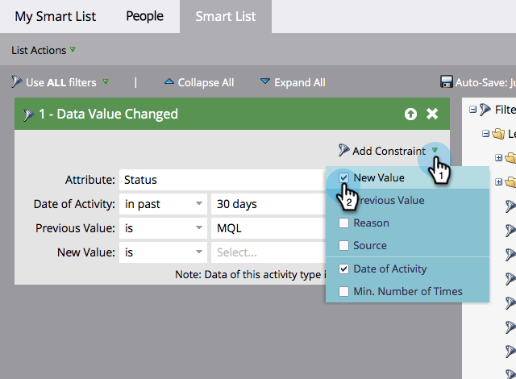

# Hinzufügen einer Einschränkung zu einem Smart-Listen-Filter {#add-a-constraint-to-a-smart-list-filter}

Beim Erstellen einer Smart-Liste verfügen einige Filter über erweiterte Optionen, die als „Einschränkungen“ bezeichnet werden. Dies sind zusätzliche Bedingungen, die Sie zu Filtern und Triggern hinzufügen können, um Ihre Suche weiter einzugrenzen.

In diesem Beispiel fügen wir einige Einschränkungen zu einem Filter **[Datenwert geändert“ hinzu](/help/marketo/product-docs/core-marketo-concepts/smart-campaigns/flow-actions/change-data-value.md){target="_blank"}** um Personen zu finden, deren Status von MQL in SQL geändert wurde.

>[!PREREQUISITES]
>
>* [Erstellen einer Smart-Liste](/help/marketo/product-docs/core-marketo-concepts/smart-lists-and-static-lists/creating-a-smart-list/create-a-smart-list.md){target="_blank"}
>* [Verwenden des Filters „Datenwert geändert“ in einer Smart-Liste](/help/marketo/product-docs/core-marketo-concepts/smart-lists-and-static-lists/using-smart-lists/use-the-data-value-changed-filter-in-a-smart-list.md){target="_blank"}

1. Navigieren Sie **[!UICONTROL Marketing-Aktivitäten]**.

   

1. Wählen Sie die Smart-Liste mit einem Filter aus, dem Sie eine Einschränkung hinzufügen möchten, und klicken Sie auf die Registerkarte **[!UICONTROL Smart-Liste]**.

   

1. Wählen **[!UICONTROL unter &quot;]** hinzufügen“ **[!UICONTROL Vorheriger Wert]**.

   

1. Geben Sie den **[!UICONTROL vorherigen Wert]** ein. In diesem Beispiel verwenden wir SQL.

   

1. Wählen **[!UICONTROL unter &quot;]** hinzufügen“ **[!UICONTROL Neuer Wert]**.

   

1. Geben Sie den neuen Wert ein. In diesem Beispiel verwenden wir SQL.

   

1. Gut gemacht! Klicken Sie auf **[!UICONTROL Personen]**, um alle Personen anzuzeigen, deren Status in den letzten 30 Tagen von „MQL“ in „SQL“ geändert wurde.
