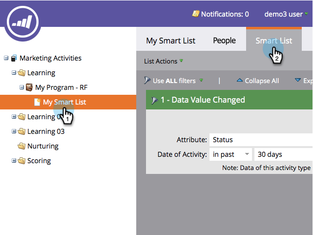

# Eine Beschränkung zu einem Smart-Listenfilter hinzufügen {#add-a-constraint-to-a-smart-list-filter}

Beim Erstellen einer Smart-Liste verfügen einige Filter über erweiterte Optionen, die als &quot;Begrenzungen&quot;bezeichnet werden. Dies sind zusätzliche Bedingungen, die Sie zu Filtern und Triggern hinzufügen können, um Ihre Suche noch weiter einzugrenzen.

Fügen wir in diesem Beispiel Einschränkungen zu einem **[Datenwert geändert](/help/marketo/product-docs/core-marketo-concepts/smart-campaigns/flow-actions/change-data-value.md){target="_blank"}** nach Personen suchen, die einen Status-Wechsel von MQL zu SQL hatten.

>[!PREREQUISITES]
>
>* [Erstellen einer Smart-Liste](/help/marketo/product-docs/core-marketo-concepts/smart-lists-and-static-lists/creating-a-smart-list/create-a-smart-list.md){target="_blank"}
>* [Verwenden des Filters &quot;Datenwert geändert&quot;in einer Smart-Liste](/help/marketo/product-docs/core-marketo-concepts/smart-lists-and-static-lists/using-smart-lists/use-the-data-value-changed-filter-in-a-smart-list.md){target="_blank"}

1. Navigieren Sie zu **[!UICONTROL Marketingaktivitäten]**.

   

1. Wählen Sie die Smart-Liste mit einem Filter aus, dem Sie eine Einschränkung hinzufügen, und klicken Sie auf die Schaltfläche **[!UICONTROL Smart List]** Registerkarte.

   

1. under **[!UICONTROL Beschränkung hinzufügen]** auswählen **[!UICONTROL Vorheriger Wert]**.

   

1. Geben Sie die **[!UICONTROL Vorheriger Wert]**. In diesem Beispiel verwenden wir MQL.

   

1. under **[!UICONTROL Beschränkung hinzufügen]** auswählen **[!UICONTROL Neuer Wert]**.

   

1. Geben Sie den neuen Wert ein. In diesem Beispiel verwenden wir SQL.

   

1. Schön gemacht! Klicken Sie auf **[!UICONTROL Personen]** um alle Personen anzuzeigen, die in den letzten 30 Tagen eine Statusänderung von &quot;MQL&quot;zu &quot;SQL&quot;hatten.
