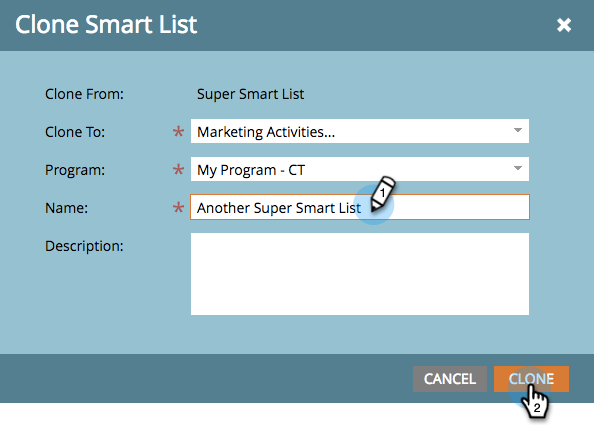

# Klonen von Listen oder Smart-Listen {#clone-a-list-or-smart-list}

Statt eine Smart-Liste von Grund auf neu zu erstellen, sparen Sie etwas Zeit, indem Sie eine ähnliche Liste klonen und Änderungen vornehmen. So geht es.

1. Navigieren Sie zu **[!UICONTROL Marketingaktivitäten]**.

   

1. Wählen Sie die Smart-Liste aus, die Sie klonen möchten.

   

1. under **[!UICONTROL Aktionen auflisten]** klicken **[!UICONTROL Klonen von Smart-Listen]**.

   

1. Geben Sie einen **[!UICONTROL Name]** und klicken **[!UICONTROL Klonen]**.

   

Gut gemacht! Sie können auch reguläre Listen auf die gleiche Weise klonen.
