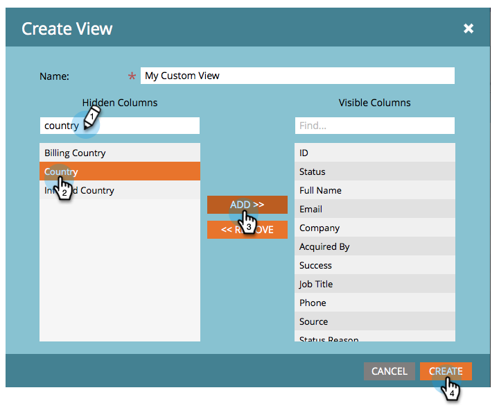

# Erstellen und Ändern von Ansichten für Listen und Smart-Listen {#create-and-change-views-for-lists-and-smart-list}

Eine intelligente Liste zeigt einen Standardsatz von Spalten an. Wusstest du, dass du diese Spalten an den Inhalt deines Herzens anpassen könntest? So geht es.

## Erstellen einer Ansicht {#create-a-view}

1. Navigieren Sie zu einer Liste oder Smart-Liste, klicken Sie auf die Schaltfläche **Personen** und klicken Sie auf **Erstellen** **Ansicht** unter **Ansicht** angezeigt.

   

1. Benennen Sie die Ansicht und suchen Sie die Spalte, die Sie hinzufügen oder entfernen möchten.

   

1. Fügen Sie die gewünschten Spalten hinzu/entfernen Sie sie und klicken Sie auf **Erstellen**.

   

>[!TIP]
>
>Um schnell zu suchen, verwenden Sie die **Suchen** ankreuzen.

## Ansichten wechseln {#switch-views}

1. Klicken Sie auf **Ansicht** und wählen Sie die gewünschte Ansicht aus. Wechseln Sie nach Bedarf zwischen Ansichten.

   

>[!NOTE]
>
> Sie müssen zunächst zusätzlich zur Standardansicht eine zweite Ansicht erstellen, um zwischen Ansichten wechseln zu können.

## Bearbeiten einer Ansicht {#edit-a-view}

1. Stellen Sie sicher, dass die gewünschte Ansicht im **Ansicht** angezeigt.

   

1. Klicken Sie auf **Bearbeiten** -Option.

   

1. Nehmen Sie die gewünschten Änderungen vor und klicken Sie auf **Speichern**.

   

## Ansicht löschen {#delete-a-view}

1. Wählen Sie die **Bearbeiten** -Option für die Ansicht, die Sie aus der **Ansicht** angezeigt.

   

1. Klicks **Löschen**.

   

Nur Sie können die benutzerdefinierten Ansichten, die Sie in der Dropdown-Liste Ansicht erstellen, sehen. Informieren Sie daher Ihre Freunde, dass sie eigene Ansichten erstellen müssen!

>[!MORELIKETHIS]
>
>* [Verwenden von integrierten/System-Smart-Listen](/help/marketo/product-docs/core-marketo-concepts/smart-lists-and-static-lists/using-smart-lists/use-built-in-system-smart-lists.md)
>* [Erstellen einer Smart-Liste](/help/marketo/product-docs/core-marketo-concepts/smart-lists-and-static-lists/creating-a-smart-list/create-a-smart-list.md)
