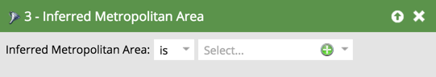
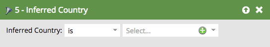

# Abgeleitete Filter {#inferred-filters}

Wenn jemand Ihre Website besucht, [&#128279;](/help/marketo/product-docs/administration/additional-integrations/add-munchkin-tracking-code-to-your-website.md){target="_blank"} MunchkinCookies und legt sie im System ab. Wir suchen ihre IP in einer speziellen Datenbank und leiten alle Arten von Informationen ab.

>[!NOTE]
>
>Um sicherzustellen, dass die abgeleiteten Feldwerte auf dem neuesten Stand bleiben, aktualisieren wir regelmäßig die Datenbank, die für die Suche nach IP-Adressen verwendet wird. Datenbankaktualisierungen können neue abgeleitete Feldwerte einführen, die Sie ggf. den Filterdefinitionen für die Smart-Liste hinzufügen müssen.
>
>Datenbankaktualisierungen können während einer [Marketo Engage-Produktversion erfolgen](/help/marketo/release-notes/release-schedule.md){target="_blank"}. Wenn eine Aktualisierung erfolgt, enthalten die [Marketo Engage-Versionshinweise](/help/marketo/release-notes/current.md){target="_blank"} eine Erläuterung aller Änderungen an abgeleiteten Feldwerten.

Wenn Sie einen dieser Filter in einer Smart List verwenden, ergeben die Ergebnisse Personen mit diesen abgeleiteten Informationen.

>[!TIP]
>
>Verwenden Sie diese Filter in einem Web-Aktivitätsbericht. Verwenden Sie die Gebiete der Vertriebsmitarbeiter und abonnieren Sie sie für einen benutzerdefinierten täglichen Bericht mit Website-Besuchern in den letzten 24 Stunden. Sie werden es lieben!
>
>* Besuchte Web-Seite - Letzte 24 Stunden
>* Abgeleiteter Staat ist [wählen Sie ihr Territorium]

Diese anonymen Besucher werden automatisch in Personen umgewandelt, wenn sie auf einen E-Mail-Link klicken oder ein Formular ausfüllen. Sie behalten jedoch alle abgeleiteten Informationen bei.

>[!NOTE]
>
>Weitere Informationen über [anonyme Aktivität und Leads](/help/marketo/product-docs/core-marketo-concepts/smart-lists-and-static-lists/managing-people-in-smart-lists/understanding-anonymous-activity-and-people.md){target="_blank"}.
