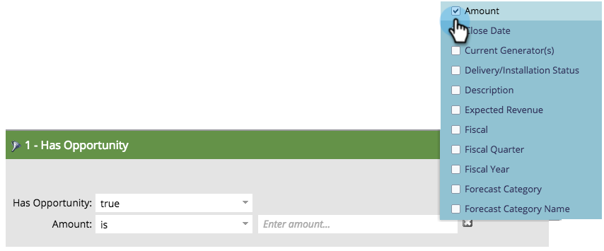

# Opportunity Filters and Trigger {#opportunity-filters-and-triggers}

Mit Opportunity-Filtern und -Triggern können Sie Opportunity-Ereignisse aus Salesforce verfolgen. Sie unterscheiden sich etwas von anderen Filtern und Triggern.

## Opportunity Filters {#opportunity-filters}

Mit Opportunity-Filtern können Sie in Ihre Salesforce-Leads vordringen, die Möglichkeiten haben. Sie finden sie beim Bearbeiten einer Smart-Liste im Ordner &quot;Chancen&quot;der Palette. Sie kommen in ein paar Geschmacksrichtungen.

* Anzahl Möglichkeiten
* Opty-Gesamtbetrag
* Erwarteter Opty-Gesamtumsatz
* Hat Opportunity
* Chancen wurden hinzugefügt
* Chancen wurden entfernt
* Opportunity wurde aktualisiert

Wenn Sie nach Ihren (benutzerdefinierten oder standardmäßigen) Opportunity-Feldern suchen, verwenden Sie den Filter **Hat Opportunity** oder **Opportunity was`[Added/Removed/Updated]`** -Filter oder -Trigger.

**Anzahl der Optionen, Gesamtanzahl der Optionen, Gesamtanzahl der Optionen, Gesamtanzahl der erwarteten Gesamteinnahmen der Option**

Mit diesen Filtern können Sie Leads auf Grundlage der Gesamtzahl, des Betrags oder des erwarteten Umsatzes aller ihrer Möglichkeiten finden.

**Hat Gelegenheit, wurde der Gelegenheit hinzugefügt, wurde aus der Gelegenheit entfernt**

Wenn Sie nach Leads suchen, die Möglichkeiten basierend auf einer Kombination von Kriterien haben, verwenden Sie den Filter **Hat Chancen**, **Wurde der Opportunity** hinzugefügt oder **Aus der Opportunity entfernt** . Sie sagen Ihnen:

* **Hat Gelegenheit**: Wenn dieser Lead derzeit eine übereinstimmende Gelegenheit hat
* **wurde der Gelegenheit hinzugefügt**: Wenn dieser Lead jemals zu einer übereinstimmenden Gelegenheit hinzugefügt wurde
* **Wurde aus Opportunity entfernt**: Wenn dieser Lead jemals aus einer übereinstimmenden Gelegenheit entfernt wurde

Fügen Sie die Suchkriterien im Filter als **Einschränkungen** hinzu. Zu den Einschränkungen gehören Ihr Opportunity-Standard und Ihre benutzerdefinierten Felder:

Angenommen, Sie möchten Leads finden, die Öffnungsmöglichkeiten von mindestens 5.000 $ haben. Ziehen Sie in den Filter **Hat Chancen** und verwenden Sie die Begrenzungen **Ist geschlossen** und **Betrag**:

>[!NOTE]
>
>Wenn Sie mehrere Opportunity-Filter verwenden, erhalten Sie möglicherweise falsche Antworten. Wenn Sie das obige Beispiel mit zwei Opportunity-Filtern erstellt haben, erhalten Sie eine Liste von Leads, die eine Chance von mindestens 5.000 $ haben, und jede Gelegenheit, die geschlossen wird, auch wenn es sich um separate Möglichkeiten handelt.

**Die Gelegenheit wurde aktualisiert**

Der Filter **Gelegenheit wurde aktualisiert** sucht nach Möglichkeiten, wenn ein bestimmtes Opportunity-Feld aktualisiert wurde. Wählen Sie das Feld aus, das mit der Pulldown-Liste &quot;Trigger-Attribut&quot;überprüft werden soll, und verwenden Sie dann die Begrenzungen, um den Änderungssatz einzuschränken.

Dieser Filter zeigt beispielsweise alle Leads an, deren Datum sich in den letzten 30 Tagen geändert hat:

## Opportunity Trigger {#opportunity-triggers}

Die folgenden Opportunity-Trigger sind verfügbar. Sie funktionieren genau wie die entsprechenden Filter (siehe Beschreibung weiter oben). Sie können jedoch Kampagnen direkt bei Eintreten des Ereignisses Trigger haben:

* Opportunity wird aktualisiert
* Zu Opportunity hinzugefügt
* Aus Opportunity entfernt

Beispielsweise können Sie diese Smart-Liste zum Trigger verwenden, wenn ein Lead einer beliebigen Gelegenheit hinzugefügt wird. Im Fluss können Sie sie der Liste Ausgesetzte Marketing hinzufügen oder ihnen eine zielgerichtete E-Mail senden.

Um Ihre Opportunity-benutzerdefinierten Felder Trigger, verwenden Sie den Trigger **Opportunity is Updated** und wählen Sie das Feld im Pulldown aus:

