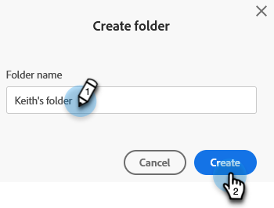

# Referenzieren einer Liste oder Smart-Liste über Arbeitsbereiche hinweg {#reference-a-list-or-smart-list-across-workspaces}

Listen und Smart-Listen können in allen Arbeitsbereichen freigegeben und referenziert werden, um eine einfache Wiederverwendung über die Datenbank zu ermöglichen.

>[!NOTE]
>
>Es gelten Regeln zur Personenpartition (Smart Lists und statische Listen in einem Arbeitsbereich zeigen nur Personen an, die beide Mitglieder der Liste _und_ des aktuellen Arbeitsbereichs sind).

## Liste oder Smart-Liste freigeben {#share-a-list-or-smart-list}

1. Wechseln Sie zur **[!UICONTROL Datenbank]**.

   

1. Klicken Sie mit der rechten Maustaste auf einen Kampagnenordner. Wählen Sie **Neuer Ordner** aus.

   

   >[!NOTE]
   >
   >Assets kann nur dann für mehrere Arbeitsbereiche freigegeben werden, wenn sie in einem Ordner verschachtelt sind.

1. Benennen Sie den Ordner und klicken Sie auf **[!UICONTROL Erstellen]**.

   

1. Ziehen Sie eine Liste oder Smart-Liste, die Sie freigeben möchten, in den neuen Ordner.

   

1. Klicken Sie mit der rechten Maustaste auf den neuen Ordner und wählen Sie **[!UICONTROL Ordner freigeben]** aus.

   

1. Wählen Sie einen **[!UICONTROL Workspace]** aus, für den Sie eine Freigabe vornehmen möchten, und klicken Sie auf **[!UICONTROL Speichern]**.

   

   Fantastisch! Diese Liste ist jetzt in beiden Arbeitsbereichen verfügbar.

   >[!NOTE]
   >
   >In Marketingaktivitäten können Sie nur Ordner der obersten Ebene freigeben. In der Datenbank können Sie Ordner der obersten Ebene sowie eine Ebene nach unten freigeben.
